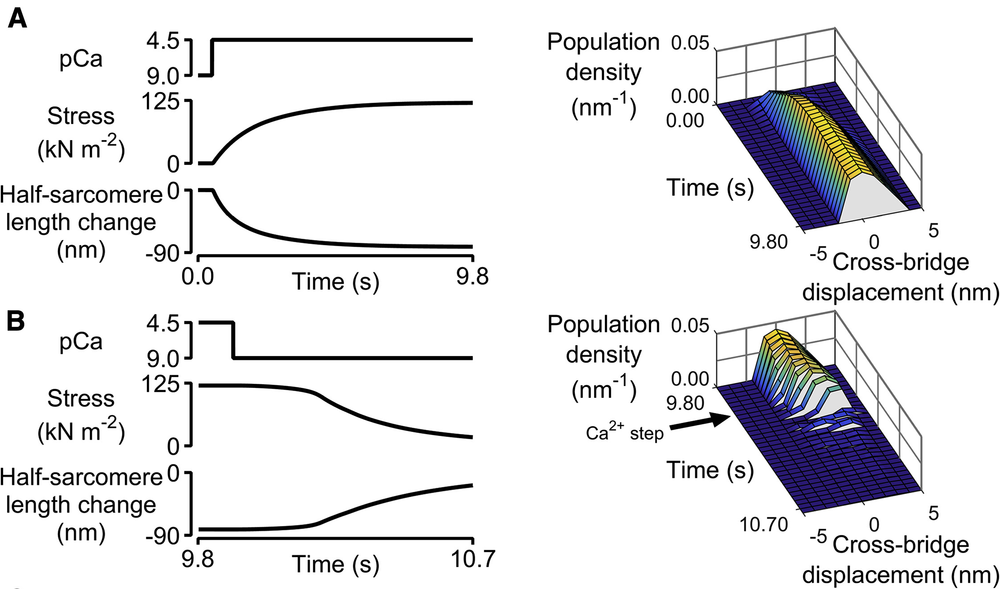

## MATMyoSim

This is the home page for MATMyoSim, a MATLAB-based implementation of the MyoSim model. You can use the code to simulate the mechanical properties of half-sarcomeres using cross-bridge distribution techniques.

Here, for example, is a simulation showing how [series compliance can lead to biphasic relaxation](https://www.ncbi.nlm.nih.gov/pmc/articles/PMC4744171/)

To get started:
+ Try the [demos](demos/demos.html)

If you got this far, you might want to know that MyoSim was originally [developed in C++](http://www.myosim.org) and has also been ported to Python. Different versions of the software are at different stages of development. Each has its strengths and weaknesses.
