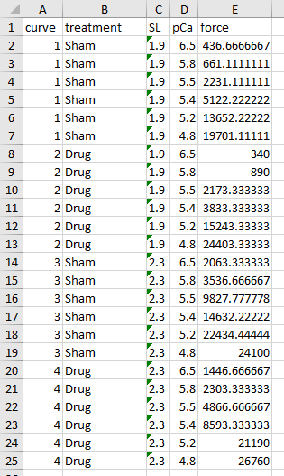
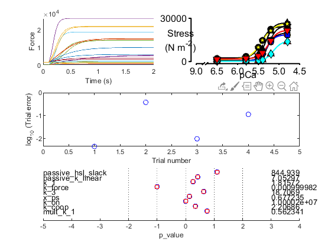
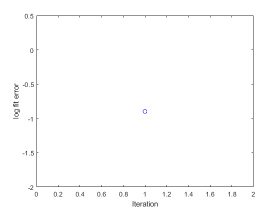
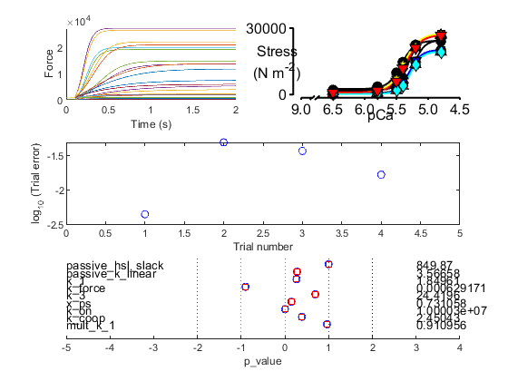
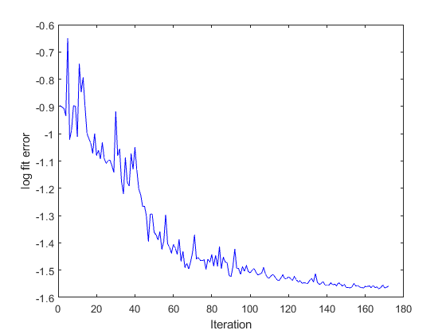

# Fitting pCa curves for two conditions at each of two lengths.

This demo shows how to fit simulations to four pCa curves. The assumption is that the muscle is tested in the absence and presence of a drug at each of two sarcomere lengths. It is further assumed that the drug changes just one model parameter, in this case `k_1`. Thus the goal is to find a single set of model parameters that fits the two curves measured at different lengths in the absence of the drug and by changing only the value of `k_1` fits the other two curves measured with the drug as well.

TThe demo will be easier to follow if you have already looked at the other examples.

## Instructions

+ Launch MATLAB
+ Change the MATLAB working directory to `<repo>/code/demos/fitting/four_curves_tension_pCa`
+ Open `demo_fit_four_curves_tension_pCa.m`
+ Press <kbd>F5</kbd> to run the demo

## Code

Here is the MATLAB code to perform the fit. As for all the fitting demos, the complexity of of the fitting process is handled by the optimization file.

````
function demo_fit_two_condition_tension_pCa
% Function demonstrates fitting a simple tension-pCa curve

% Variables
optimization_file_string = 'sim_input/optimization.json';

% Code

% Make sure the path allows us to find the right files
addpath(genpath('../../../../code'));

% Load optimization job
opt_json = loadjson(optimization_file_string);
opt_structure = opt_json.MyoSim_optimization;

% Start the optimization
fit_controller(opt_structure, ...
    'single_run', 0);
````

## What the code does

The first 3 lines of (non-commented) code
+ make sure the MATMyoSim project is available on the current path
+ sets the file which definines an [optimization structure](..\..\structures\optimization_structure.html)  
+ loads the structure into memory

The last line of code calls `fit_controller.m` which runs the optimization defined in `optimization.json`

## Optimization file

Here's the optimization file. While it is quite long, it simply integrates the `constraint` approach described for [fitting pCa curves with two conditions](../pCa_curves_two_conditions/pCa_curves_two_conditions.html) with the `initial_delta_hsl` option described for [fitting pCa curves with two lengths](../pCa_curves_two_lengths/pCa_curves_two_lengths.html).

This time around, the data in Excel show four curves. The label in the curve column shows which force values go with which curve.



Since each curve is defined by 6 pCa values, the full simulation consists of 24 `jobs`. For simplicity, these are separated into separate folders for each combination of curve and pCa value.

````
{
	"MyoSim_optimization":
	{
        "model_template_file_string": "sim_input/model_template.json",

        "fit_mode": "fit_pCa_curve",
        "fit_variable": "muscle_force",

        "target_file_string": "target_data/target_force_pCa_data.xlsx",
        "target_field": "force",
        
        "best_model_folder": "temp/best",
        "best_opt_file_string": "temp/best/best_tension_pCa_model.json",

        "figure_current_fit": 2,
        "figure_optimization_progress": 3, 
        
        "job":
        [
            {
                "model_file_string": "temp/1/65/model_worker_65.json",
                "protocol_file_string": "sim_input/1/65/protocol_65.txt",
                "options_file_string": "sim_input/sim_options.json",
                "results_file_string": "temp/1/65/65.myo"
            },
            {
                "model_file_string": "temp/1/58/model_worker_58.json",
                "protocol_file_string": "sim_input/1/58/protocol_58.txt",
                "options_file_string": "sim_input/sim_options.json",
                "results_file_string": "temp/1/58/58.myo"
            },
            {
                "model_file_string": "temp/1/55/model_worker_55.json",
                "protocol_file_string": "sim_input/1/55/protocol_55.txt",
                "options_file_string": "sim_input/sim_options.json",
                "results_file_string": "temp/1/55/55.myo"
            },
            {
                "model_file_string": "temp/1/54/model_worker_54.json",
                "protocol_file_string": "sim_input/1/54/protocol_54.txt",
                "options_file_string": "sim_input/sim_options.json",
                "results_file_string": "temp/1/54/54.myo"
            },
            {
                "model_file_string": "temp/1/52/model_worker_52.json",
                "protocol_file_string": "sim_input/1/52/protocol_52.txt",
                "options_file_string": "sim_input/sim_options.json",
                "results_file_string": "temp/1/52/52.myo"
            },
            {
                "model_file_string": "temp/1/48/model_worker_48.json",
                "protocol_file_string": "sim_input/1/48/protocol_48.txt",
                "options_file_string": "sim_input/sim_options.json",
                "results_file_string": "temp/1/48/48.myo"
            },
            {
                "model_file_string": "temp/2/65/model_worker_65.json",
                "protocol_file_string": "sim_input/2/65/protocol_65.txt",
                "options_file_string": "sim_input/sim_options.json",
                "results_file_string": "temp/2/65/65.myo"
            },
            {
                "model_file_string": "temp/2/58/model_worker_58.json",
                "protocol_file_string": "sim_input/2/58/protocol_58.txt",
                "options_file_string": "sim_input/sim_options.json",
                "results_file_string": "temp/2/58/58.myo"
            },
            {
                "model_file_string": "temp/2/55/model_worker_55.json",
                "protocol_file_string": "sim_input/2/55/protocol_55.txt",
                "options_file_string": "sim_input/sim_options.json",
                "results_file_string": "temp/2/55/55.myo"
            },
            {
                "model_file_string": "temp/2/54/model_worker_54.json",
                "protocol_file_string": "sim_input/2/54/protocol_54.txt",
                "options_file_string": "sim_input/sim_options.json",
                "results_file_string": "temp/2/54/54.myo"
            },
            {
                "model_file_string": "temp/2/52/model_worker_52.json",
                "protocol_file_string": "sim_input/2/52/protocol_52.txt",
                "options_file_string": "sim_input/sim_options.json",
                "results_file_string": "temp/2/52/52.myo"
            },
            {
                "model_file_string": "temp/2/48/model_worker_48.json",
                "protocol_file_string": "sim_input/2/48/protocol_48.txt",
                "options_file_string": "sim_input/sim_options.json",
                "results_file_string": "temp/2/48/48.myo"
            },
            {
                "model_file_string": "temp/3/65/model_worker_65.json",
                "protocol_file_string": "sim_input/3/65/protocol_65.txt",
                "options_file_string": "sim_input/sim_options.json",
                "results_file_string": "temp/3/65/65.myo"
            },
            {
                "model_file_string": "temp/3/58/model_worker_58.json",
                "protocol_file_string": "sim_input/3/58/protocol_58.txt",
                "options_file_string": "sim_input/sim_options.json",
                "results_file_string": "temp/3/58/58.myo"
            },
            {
                "model_file_string": "temp/3/55/model_worker_55.json",
                "protocol_file_string": "sim_input/3/55/protocol_55.txt",
                "options_file_string": "sim_input/sim_options.json",
                "results_file_string": "temp/3/55/55.myo"
            },
            {
                "model_file_string": "temp/3/54/model_worker_54.json",
                "protocol_file_string": "sim_input/3/54/protocol_54.txt",
                "options_file_string": "sim_input/sim_options.json",
                "results_file_string": "temp/3/54/54.myo"
            },
            {
                "model_file_string": "temp/3/52/model_worker_52.json",
                "protocol_file_string": "sim_input/3/52/protocol_52.txt",
                "options_file_string": "sim_input/sim_options.json",
                "results_file_string": "temp/3/52/52.myo"
            },
            {
                "model_file_string": "temp/3/48/model_worker_48.json",
                "protocol_file_string": "sim_input/3/48/protocol_48.txt",
                "options_file_string": "sim_input/sim_options.json",
                "results_file_string": "temp/3/48/48.myo"
            },
            {
                "model_file_string": "temp/4/65/model_worker_65.json",
                "protocol_file_string": "sim_input/4/65/protocol_65.txt",
                "options_file_string": "sim_input/sim_options.json",
                "results_file_string": "temp/4/65/65.myo"
            },
            {
                "model_file_string": "temp/4/58/model_worker_58.json",
                "protocol_file_string": "sim_input/4/58/protocol_58.txt",
                "options_file_string": "sim_input/sim_options.json",
                "results_file_string": "temp/4/58/58.myo"
            },
            {
                "model_file_string": "temp/4/55/model_worker_55.json",
                "protocol_file_string": "sim_input/4/55/protocol_55.txt",
                "options_file_string": "sim_input/sim_options.json",
                "results_file_string": "temp/4/55/55.myo"
            },
            {
                "model_file_string": "temp/4/54/model_worker_54.json",
                "protocol_file_string": "sim_input/4/54/protocol_54.txt",
                "options_file_string": "sim_input/sim_options.json",
                "results_file_string": "temp/4/54/54.myo"
            },
            {
                "model_file_string": "temp/4/52/model_worker_52.json",
                "protocol_file_string": "sim_input/4/52/protocol_52.txt",
                "options_file_string": "sim_input/sim_options.json",
                "results_file_string": "temp/4/52/52.myo"
            },
            {
                "model_file_string": "temp/4/48/model_worker_48.json",
                "protocol_file_string": "sim_input/4/48/protocol_48.txt",
                "options_file_string": "sim_input/sim_options.json",
                "results_file_string": "temp/4/48/48.myo"
            }
        ],
		"parameter": [
			{
				"name": "passive_hsl_slack",
				"min_value": 800,
				"max_value": 850,
				"p_value": 1.101214326,
				"p_mode": "lin"
			},
			{
				"name": "passive_k_linear",
				"min_value": 0,
				"max_value": 2,
				"p_value": 0.4241861649,
				"p_mode": "log"
			},
			{
				"name": "k_1",
				"min_value": 0,
				"max_value": 1,
				"p_value": 0.2590491965,
				"p_mode": "log"
			},
			{
				"name": "k_force",
				"min_value": -5,
				"max_value": -3,
				"p_value": -0.9999960547,
				"p_mode": "log"
			},
			{
				"name": "k_3",
				"min_value": 0,
				"max_value": 2,
				"p_value": 0.6360008379,
				"p_mode": "log"
			},
			{
				"name": "x_ps",
				"min_value": 0,
				"max_value": 5,
				"p_value": 0.1354469183,
				"p_mode": "lin"
			},
			{
				"name": "k_on",
				"min_value": 7,
				"max_value": 8,
				"p_value": 9.586854697e-06,
				"p_mode": "log"
			},
			{
				"name": "k_coop",
				"min_value": 0,
				"max_value": 1,
				"p_value": 0.3437755959,
				"p_mode": "log"
			}
		],
        "initial_delta_hsl": [0, 0, 0, 0, 0, 0, 0, 0, 0, 0, 0, 0, 200, 200, 200, 200, 200, 200, 200, 200, 200, 200, 200, 200],
        "constraint":
        [
            {
                "job_number": 7,
                "parameter_multiplier":
                [
                    {
                        "name": "k_1",
                        "base_job_number": 1,
                        "min_value": -1,
                        "max_value": 0,
                        "p_value": 0.75,
                        "p_mode": "log"
                    }
                ]
            },
            {
                "job_number": 8,
                "parameter_copy":
                [
                    {
                        "name": "k_1",
                        "copy_job_number": 7
                    }
                ]
            },
            {
                "job_number": 9,
                "parameter_copy":
                [
                    {
                        "name": "k_1",
                        "copy_job_number": 7
                    }
                ]
            },
            {
                "job_number": 10,
                "parameter_copy":
                [
                    {
                        "name": "k_1",
                        "copy_job_number": 7
                    }
                ]
            },
            {
                "job_number": 11,
                "parameter_copy":
                [
                    {
                        "name": "k_1",
                        "copy_job_number": 7
                    }
                ]
            },
            {
                "job_number": 12,
                "parameter_copy":
                [
                    {
                        "name": "k_1",
                        "copy_job_number": 7
                    }
                ]
            },
            {
                "job_number": 19,
                "parameter_copy":
                [
                    {
                        "name": "k_1",
                        "copy_job_number": 7
                    }
                ]
            },
            {
                "job_number": 20,
                "parameter_copy":
                [
                    {
                        "name": "k_1",
                        "copy_job_number": 7
                    }
                ]
            },
            {
                "job_number": 21,
                "parameter_copy":
                [
                    {
                        "name": "k_1",
                        "copy_job_number": 7
                    }
                ]
            },
            {
                "job_number": 22,
                "parameter_copy":
                [
                    {
                        "name": "k_1",
                        "copy_job_number": 7
                    }
                ]
            },
            {
                "job_number": 23,
                "parameter_copy":
                [
                    {
                        "name": "k_1",
                        "copy_job_number": 7
                    }
                ]
            },
            {
                "job_number": 24,
                "parameter_copy":
                [
                    {
                        "name": "k_1",
                        "copy_job_number": 7
                    }
                ]
            }
        ]
    }
}
````

## First iteration

As described for [single pCa curve fit](../pCa_single_curve/pCa_single_curve.html), the first iteration will produce 2 figures.

Fig 3 summarizes how the simulation matches the target data defined in the optimization structure.
+ top panel, compares the current simulation to the target data
+ middle panel, shows the relative errors for the different trials (although there is only 1 in this case)
+ bottom panel, shows the parameter values



Fig 4 shows a single circle. This is the value of the error function which quantifies the difference between the current simulation and the target data. The goal of the fitting procedure is to lower this value in successive iterations.



## Iterations

The code will continue to run simulations adjusting the values of 9 parameters, 8 of which describe the base model, and the last of which is the parameter mulitplier that distinguishes `k_2` for the two curves. As the iterations progress, the value of the error function will trend down, indicating that the fit is getting better.

## Final fit

The final summary and progress figures are shown below. Note that your progress figure might look slightly different because the optimization is based on randomly generated numbers.





## Recovering the best fit

Each time the optimization process found a better fit, it
+ updated the optimization template in `best_opt_file_string`. This file is identical to the original optimization structure but with updated p values.
+ wrote the `model files` for each `job` to the `best_model_folder`.

You can recreate the best fitting simulation using these files. For example, you can update the demo code so that optimization file string points to `temp/best/best_tension_pCa_model.json`. If you also set the `single_run` option to 1 in the last line, the code will only create a single curve. That is, it won't try and optimize a fit that should already be 'optimal'.

If you need to access the data for individual simulations, you can load the *.myo files defined in the job structures. See other demos on how to do this.
