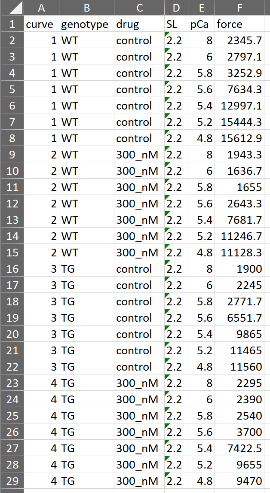
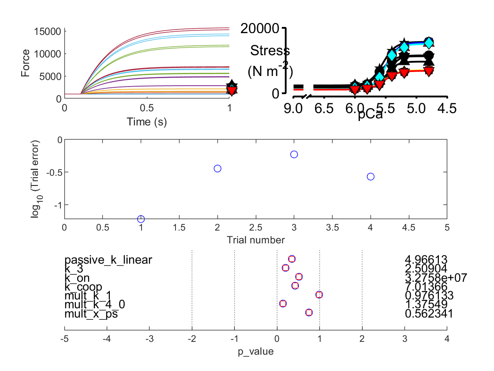
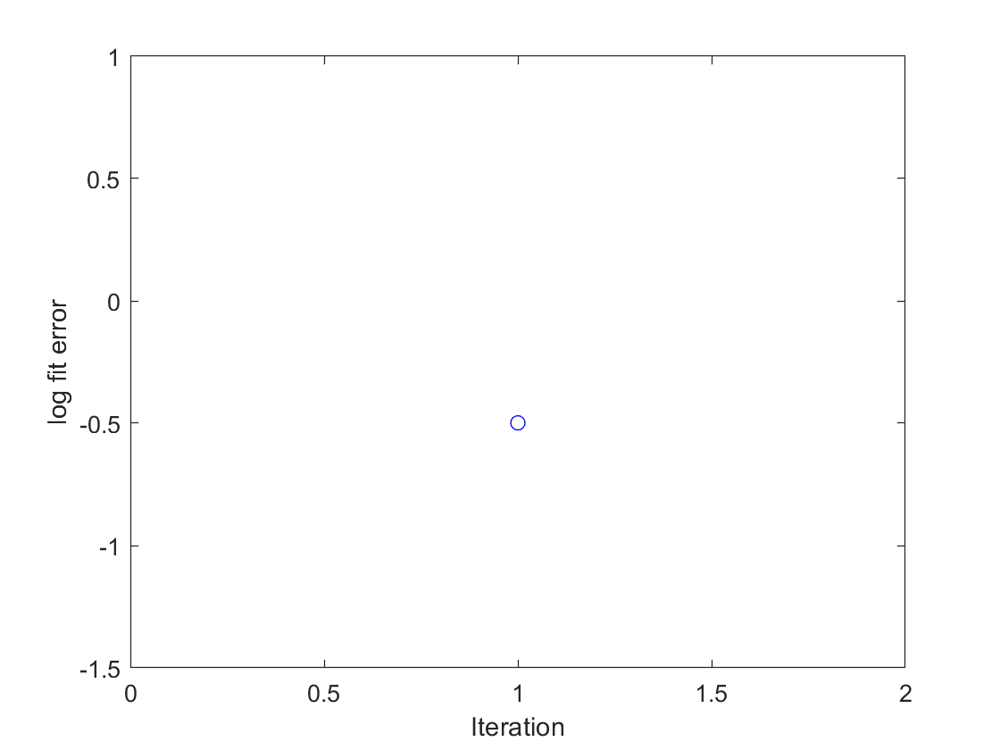
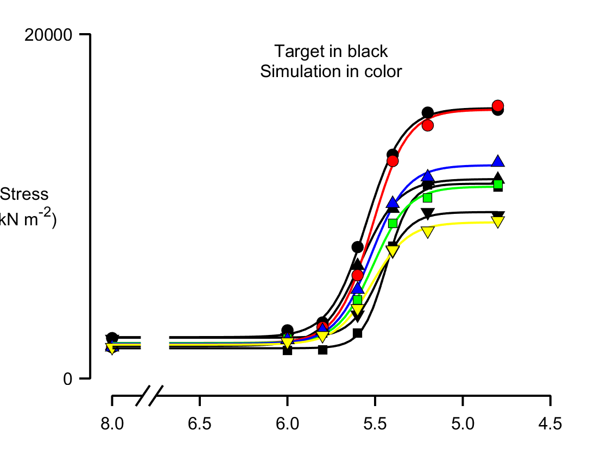

# Fitting pCa curves for two by two condition design

This demo shows how to fit simulations to four pCa curves. The assumption is that muscles from a wild-type and a knock-out animal are tested in the absence and presence of a drug.

It is further assumed that the genetic manipulation changes one model parameter `x_ps` and that the drug changes two parameters, `k_1` and `k_3`. Thus the goal is to find a single set of model parameters that fits the two curves measured in the wild-type muscles and by changing only the value of `x_ps` fits the other two curves measured in the knock-out muscles.

The demo will be easier to follow if you have already looked at the other examples.

## Instructions

+ Launch MATLAB
+ Change the MATLAB working directory to `<repo>/code/demos/fitting/two_by_two_tension_pCa`
+ Open `demo_fit_two_by_two_curves_tension_pCa.m`
+ Press <kbd>F5</kbd> to run the demo

## Code

Here is the MATLAB code to perform the fit. As for all the fitting demos, the complexity of of the fitting process is handled by the optimization file.

````
function demo_fit_two_by_two_curves_tension_pCa
% Function demonstrates fitting a simple tension-pCa curve

% Variables
optimization_file_string = 'sim_input/optimization.json';

% Code

% Make sure the path allows us to find the right files
addpath(genpath('../../../../code'));

% Load optimization job
opt_json = loadjson(optimization_file_string);
opt_structure = opt_json.MyoSim_optimization;

% Start the optimization
fit_controller(opt_structure, ...
    'single_run', 0);
````

## What the code does

The first 3 lines of (non-commented) code
+ make sure the MATMyoSim project is available on the current path
+ sets the file which definines an [optimization structure](..\..\structures\optimization_structure.html)  
+ loads the structure into memory

The last line of code calls `fit_controller.m` which runs the optimization defined in `optimization.json`

## Target data

The target data (that is, the experimental data you are trying to fit) are provided in Excel and show four curves. The label in the curve column shows which force values go with which curve.



## Optimization file

Here's the optimization file. While it is quite long, the framework is simple and builds on the prior examples.

Since each curve is defined by 7 pCa values, the full simulation consists of 28 `jobs`. For simplicity, these are separated into separate folders for each combination of curve and pCa value.

The `parameter` section allows the following parameters to be adjusted across the simulations.
+ passive_k_linear
+ k_1
+ k_on
+ k_coop

The `constraint` system is used to generate the 4 curves corresponding to the wild-type / knock-out muscle in the absence / presence of the drug.

Jobs 1 to 7 generate the first curve (wild-type muscle without drug) using the standard parameters for the model.

Jobs 8 to 14 define the second curve (wild-type muscle with drug). The effect of the drug is implemented by multiplying k_1 and k_4_0 by two adjustable factors in job 8. The results for k_1 and k_4_0 are copied across to jobs 9 to 14.

Similarly, jobs 15 to 21 correspond to the knock-out muscle without drug. This is implemented by multiplying x_ps by a third adjustable factor for job 15 and copying the result across to jobs 16 to 21.

The curve for the knock-out muscle with drug is generated by copying the adjusted all three of the adjusted k_1, k_4_0, and x_ps values to jobs 22 to 28.


````
{
	"MyoSim_optimization":
	{
        "model_template_file_string": "sim_input/model_template.json",

        "fit_mode": "fit_pCa_curve",
        "fit_variable": "muscle_force",

        "target_file_string": "target_data/target_data.xlsx",
        "target_field": "force",
        
        "best_model_folder": "temp/best",
        "best_opt_file_string": "temp/best/best_tension_pCa_model.json",

        "figure_current_fit": 2,
        "figure_optimization_progress": 3, 
        
        "job":
        [
            {
                "model_file_string": "temp/1/80/model_worker_80.json",
                "protocol_file_string": "sim_input/1/80/protocol_80.txt",
                "options_file_string": "sim_input/sim_options.json",
                "results_file_string": "temp/1/80/80.myo"
            },
            {
                "model_file_string": "temp/1/60/model_worker_60.json",
                "protocol_file_string": "sim_input/1/60/protocol_60.txt",
                "options_file_string": "sim_input/sim_options.json",
                "results_file_string": "temp/1/60/60.myo"
            },
            {
                "model_file_string": "temp/1/58/model_worker_58.json",
                "protocol_file_string": "sim_input/1/58/protocol_58.txt",
                "options_file_string": "sim_input/sim_options.json",
                "results_file_string": "temp/1/58/58.myo"
            },
            {
                "model_file_string": "temp/1/56/model_worker_56.json",
                "protocol_file_string": "sim_input/1/56/protocol_56.txt",
                "options_file_string": "sim_input/sim_options.json",
                "results_file_string": "temp/1/56/56.myo"
            },
            {
                "model_file_string": "temp/1/54/model_worker_54.json",
                "protocol_file_string": "sim_input/1/54/protocol_54.txt",
                "options_file_string": "sim_input/sim_options.json",
                "results_file_string": "temp/1/54/54.myo"
            },
            {
                "model_file_string": "temp/1/52/model_worker_52.json",
                "protocol_file_string": "sim_input/1/52/protocol_52.txt",
                "options_file_string": "sim_input/sim_options.json",
                "results_file_string": "temp/1/52/52.myo"
            },
            {
                "model_file_string": "temp/1/48/model_worker_48.json",
                "protocol_file_string": "sim_input/1/48/protocol_48.txt",
                "options_file_string": "sim_input/sim_options.json",
                "results_file_string": "temp/1/48/48.myo"
            },
            {
                "model_file_string": "temp/2/80/model_worker_80.json",
                "protocol_file_string": "sim_input/1/80/protocol_80.txt",
                "options_file_string": "sim_input/sim_options.json",
                "results_file_string": "temp/2/80/80.myo"
            },
            {
                "model_file_string": "temp/2/60/model_worker_60.json",
                "protocol_file_string": "sim_input/1/60/protocol_60.txt",
                "options_file_string": "sim_input/sim_options.json",
                "results_file_string": "temp/2/60/60.myo"
            },
            {
                "model_file_string": "temp/2/58/model_worker_58.json",
                "protocol_file_string": "sim_input/1/58/protocol_58.txt",
                "options_file_string": "sim_input/sim_options.json",
                "results_file_string": "temp/2/58/58.myo"
            },
            {
                "model_file_string": "temp/2/56/model_worker_56.json",
                "protocol_file_string": "sim_input/1/56/protocol_56.txt",
                "options_file_string": "sim_input/sim_options.json",
                "results_file_string": "temp/2/56/56.myo"
            },
            {
                "model_file_string": "temp/2/54/model_worker_54.json",
                "protocol_file_string": "sim_input/1/54/protocol_54.txt",
                "options_file_string": "sim_input/sim_options.json",
                "results_file_string": "temp/2/54/54.myo"
            },
            {
                "model_file_string": "temp/2/52/model_worker_52.json",
                "protocol_file_string": "sim_input/1/52/protocol_52.txt",
                "options_file_string": "sim_input/sim_options.json",
                "results_file_string": "temp/2/52/52.myo"
            },
            {
                "model_file_string": "temp/2/48/model_worker_48.json",
                "protocol_file_string": "sim_input/1/48/protocol_48.txt",
                "options_file_string": "sim_input/sim_options.json",
                "results_file_string": "temp/2/48/48.myo"
            },
            {
                "model_file_string": "temp/3/80/model_worker_80.json",
                "protocol_file_string": "sim_input/1/80/protocol_80.txt",
                "options_file_string": "sim_input/sim_options.json",
                "results_file_string": "temp/3/80/80.myo"
            },
            {
                "model_file_string": "temp/3/60/model_worker_60.json",
                "protocol_file_string": "sim_input/1/60/protocol_60.txt",
                "options_file_string": "sim_input/sim_options.json",
                "results_file_string": "temp/3/60/60.myo"
            },
            {
                "model_file_string": "temp/3/58/model_worker_58.json",
                "protocol_file_string": "sim_input/1/58/protocol_58.txt",
                "options_file_string": "sim_input/sim_options.json",
                "results_file_string": "temp/3/58/58.myo"
            },
            {
                "model_file_string": "temp/3/56/model_worker_56.json",
                "protocol_file_string": "sim_input/1/56/protocol_56.txt",
                "options_file_string": "sim_input/sim_options.json",
                "results_file_string": "temp/3/56/56.myo"
            },
            {
                "model_file_string": "temp/3/54/model_worker_54.json",
                "protocol_file_string": "sim_input/1/54/protocol_54.txt",
                "options_file_string": "sim_input/sim_options.json",
                "results_file_string": "temp/3/54/54.myo"
            },
            {
                "model_file_string": "temp/3/52/model_worker_52.json",
                "protocol_file_string": "sim_input/1/52/protocol_52.txt",
                "options_file_string": "sim_input/sim_options.json",
                "results_file_string": "temp/3/52/52.myo"
            },
            {
                "model_file_string": "temp/3/48/model_worker_48.json",
                "protocol_file_string": "sim_input/1/48/protocol_48.txt",
                "options_file_string": "sim_input/sim_options.json",
                "results_file_string": "temp/3/48/48.myo"
            },
            {
                "model_file_string": "temp/4/80/model_worker_80.json",
                "protocol_file_string": "sim_input/1/80/protocol_80.txt",
                "options_file_string": "sim_input/sim_options.json",
                "results_file_string": "temp/4/80/80.myo"
            },
            {
                "model_file_string": "temp/4/60/model_worker_60.json",
                "protocol_file_string": "sim_input/1/60/protocol_60.txt",
                "options_file_string": "sim_input/sim_options.json",
                "results_file_string": "temp/4/60/60.myo"
            },
            {
                "model_file_string": "temp/4/58/model_worker_58.json",
                "protocol_file_string": "sim_input/1/58/protocol_58.txt",
                "options_file_string": "sim_input/sim_options.json",
                "results_file_string": "temp/4/58/58.myo"
            },
            {
                "model_file_string": "temp/4/56/model_worker_56.json",
                "protocol_file_string": "sim_input/1/56/protocol_56.txt",
                "options_file_string": "sim_input/sim_options.json",
                "results_file_string": "temp/4/56/56.myo"
            },
            {
                "model_file_string": "temp/4/54/model_worker_54.json",
                "protocol_file_string": "sim_input/1/54/protocol_54.txt",
                "options_file_string": "sim_input/sim_options.json",
                "results_file_string": "temp/4/54/54.myo"
            },
            {
                "model_file_string": "temp/4/52/model_worker_52.json",
                "protocol_file_string": "sim_input/1/52/protocol_52.txt",
                "options_file_string": "sim_input/sim_options.json",
                "results_file_string": "temp/4/52/52.myo"
            },
            {
                "model_file_string": "temp/4/48/model_worker_48.json",
                "protocol_file_string": "sim_input/1/48/protocol_48.txt",
                "options_file_string": "sim_input/sim_options.json",
                "results_file_string": "temp/4/48/48.myo"
            }
        ],
		"parameter": [
			{
				"name": "passive_k_linear",
				"min_value": 0,
				"max_value": 2,
				"p_value": 0.3480091668,
				"p_mode": "log"
			},
			{
				"name": "k_3",
				"min_value": 0,
				"max_value": 2,
				"p_value": 0.19975374,
				"p_mode": "log"
			},
			{
				"name": "k_on",
				"min_value": 7,
				"max_value": 8,
				"p_value": 0.5153176216,
				"p_mode": "log"
			},
			{
				"name": "k_coop",
				"min_value": 0,
				"max_value": 2,
				"p_value": 0.422972225,
				"p_mode": "log"
			}
		],
		"constraint": [
			{
				"job_number": 8,
				"parameter_multiplier": [
					{
						"name": "k_1",
						"base_job_number": 1,
						"min_value": -1,
						"max_value": 0,
						"p_value": 0.9895091608,
						"p_mode": "log"
					},
					{
						"name": "k_4_0",
						"base_job_number": 1,
						"min_value": 0,
						"max_value": 1,
						"p_value": 0.1384579203,
						"p_mode": "log"
					}
				]
            },
            {
                "job_number": 10,
                "parameter_copy":
                [
                    {
                        "name": "k_1",
                        "copy_job_number": 8
                    }
                ]
            },
            {
                "job_number": 11,
                "parameter_copy":
                [
                    {
                        "name": "k_1",
                        "copy_job_number": 8
                    }
                ]
            },
            {
                "job_number": 12,
                "parameter_copy":
                [
                    {
                        "name": "k_1",
                        "copy_job_number": 8
                    }
                ]
            },
            {
                "job_number": 13,
                "parameter_copy":
                [
                    {
                        "name": "k_1",
                        "copy_job_number": 8
                    }
                ]
            },
            {
                "job_number": 14,
                "parameter_copy":
                [
                    {
                        "name": "k_1",
                        "copy_job_number": 8
                    }
                ]
            },
            {
                "job_number": 15,
                "parameter_multiplier":
                [
                    {
                        "name": "x_ps",
                        "base_job_number": 1,
                        "min_value": -1,
                        "max_value": 0,
                        "p_value": 0.75,
                        "p_mode": "log"
                    }
                ]
            },
            {
                "job_number": 16,
                "parameter_copy":
                [
                    {
                        "name": "x_ps",
                        "copy_job_number": 15
                    }
                ]
            },
            {
                "job_number": 17,
                "parameter_copy":
                [
                    {
                        "name": "x_ps",
                        "copy_job_number": 15
                    }
                ]
            },
            {
                "job_number": 18,
                "parameter_copy":
                [
                    {
                        "name": "x_ps",
                        "copy_job_number": 15
                    }
                ]
            },
            {
                "job_number": 19,
                "parameter_copy":
                [
                    {
                        "name": "x_ps",
                        "copy_job_number": 15
                    }
                ]
            },
            {
                "job_number": 20,
                "parameter_copy":
                [
                    {
                        "name": "x_ps",
                        "copy_job_number": 15
                    }
                ]
            },
            {
                "job_number": 21,
                "parameter_copy":
                [
                    {
                        "name": "x_ps",
                        "copy_job_number": 15
                    }
                ]
            },
            {
                "job_number": 22,
                "parameter_copy":
                [
                    {
                        "name": "k_1",
                        "copy_job_number": 8
                    },
                    {
                        "name": "x_ps",
                        "copy_job_number": 15
                    }
                ]
            },
            {
                "job_number": 23,
                "parameter_copy":
                [
                    {
                        "name": "k_1",
                        "copy_job_number": 8
                    },
                    {
                        "name": "x_ps",
                        "copy_job_number": 15
                    }
                ]
            },
            {
                "job_number": 24,
                "parameter_copy":
                [
                    {
                        "name": "k_1",
                        "copy_job_number": 8
                    },
                    {
                        "name": "x_ps",
                        "copy_job_number": 15
                    }
                ]
            },
            {
                "job_number": 25,
                "parameter_copy":
                [
                    {
                        "name": "k_1",
                        "copy_job_number": 8
                    },
                    {
                        "name": "x_ps",
                        "copy_job_number": 15
                    }
                ]
            },
            {
                "job_number": 26,
                "parameter_copy":
                [
                    {
                        "name": "k_1",
                        "copy_job_number": 8
                    },
                    {
                        "name": "x_ps",
                        "copy_job_number": 15
                    }
                ]
            },
            {
                "job_number": 27,
                "parameter_copy":
                [
                    {
                        "name": "k_1",
                        "copy_job_number": 8
                    },
                    {
                        "name": "x_ps",
                        "copy_job_number": 15
                    }
                ]
            },
            {
                "job_number": 28,
                "parameter_copy":
                [
                    {
                        "name": "k_1",
                        "copy_job_number": 8
                    },
                    {
                        "name": "x_ps",
                        "copy_job_number": 15
                    }
                ]
            }
        ]
    }
}
````

## First iteration

As described for [single pCa curve fit](../pCa_single_curve/pCa_single_curve.html), the first iteration will produce 2 figures.

Fig 3 summarizes how the simulation matches the target data defined in the optimization structure.
+ top panel, compares the current simulation to the target data
+ middle panel, shows the relative errors for the 4 different trials
+ bottom panel, shows the parameter values



Fig 4 shows a single circle. This is the value of the error function which quantifies the difference between the current simulation and the target data. The goal of the fitting procedure is to lower this value in successive iterations.



## Iterations

The code will continue to run simulations adjusting the values of 7 parameters, 4 of which describe the base model, two of which describe the effects of the drug, and the last of which describes the effects of the knock-out. As the iterations progress, the value of the error function will trend down, indicating that the fit is getting better.

## Final fit

## Recovering the best fit

Each time the optimization process found a better fit, it
+ updated the optimization template in `best_opt_file_string`. This file is identical to the original optimization structure but with updated p values.
+ wrote the `model files` for each `job` to the `best_model_folder`.

You can recreate the best fitting simulation using these files. For example, you can update the demo code so that optimization file string points to `temp/best/best_tension_pCa_model.json`. If you also set the `single_run` option to 1 in the last line, the code will only create a single curve. That is, it won't try and optimize a fit that should already be 'optimal'.

If you need to access the data for individual simulations, you can load the *.myo files defined in the job structures.

This code snippet shows a quick example linking everything together.

````
function demo_recreate_best_fit
% Function demonstrates fitting a simple tension-pCa curve

% Variables
optimization_file_string = 'workers/best_tension_pCa_model_after_optimization.json';
target_data_file_string = 'target_data/target_data.xlsx';

marker_symbols = repmat({'o','s','^','v'},[1 2]);
marker_colors = [zeros(4,3) ; [1 0 0;0 1 0;0 0 1;1 1 0]]; 

% Code

% Make sure the path allows us to find the right files
addpath(genpath('../../../../code'));

% Load optimization job
opt_json = loadjson(optimization_file_string);
opt_structure = opt_json.MyoSim_optimization;

% Start the optimization
fit_controller(opt_structure, ...
    'single_run', 1);

a = opt_structure
no_of_curves = 4;
pCa_values_per_curve = 7;


% Read in target data
td = readtable(target_data_file_string);

% Create curves
for curve_counter = 1 : no_of_curves
    vi = find(td.curve == curve_counter);
    for pCa_counter = 1 : numel(vi)
        pd(curve_counter).pCa(pCa_counter) = ...
            td.pCa(vi(pCa_counter));
        pd(curve_counter).y(pCa_counter) = ...
            td.force(vi(pCa_counter));
        pd(curve_counter).y_error(pCa_counter) = ...
            0;
    end
    [pd(curve_counter).pCa50, pd(curve_counter).n_h, ~,~,~, ...
        pd(curve_counter).x_fit, pd(curve_counter).y_fit] = ...
            fit_Hill_curve(pd(curve_counter).pCa, ...
                pd(curve_counter).y);
end

% Add in simulation data
ind = 1;
for curve_counter = 1 : no_of_curves
    for pCa_counter = 1 : pCa_values_per_curve
        result_file_string = opt_structure.job{ind}.results_file_string;
        
        sim = load(result_file_string, '-mat');
        sim_output= sim.sim_output;

        pd(curve_counter + no_of_curves).pCa(pCa_counter) = -log10(sim_output.Ca(end));
        pd(curve_counter + no_of_curves).y(pCa_counter) = sim_output.hs_force(end);
        pd(curve_counter + no_of_curves).y_error(pCa_counter) = 0;
        
        ind = ind + 1;
    end
    
    [pd(curve_counter + no_of_curves).pCa50, ...
        pd(curve_counter + no_of_curves).n_h, ~,~,~, ...
        pd(curve_counter + no_of_curves).x_fit, ...
        pd(curve_counter + no_of_curves).y_fit] = ...
            fit_Hill_curve(pd(curve_counter + no_of_curves).pCa, ...
                pd(curve_counter + no_of_curves).y);
end

figure(1);
clf;
plot_pCa_data_with_y_errors(pd, ...
        'marker_face_colors',marker_colors, ...
        'marker_symbols',marker_symbols, ...
        'high_pCa_value', 8.0, ...
        'title',{'Target in black','Simulation in color'}, ...
        'title_y_offset', 0.9);
````

## Output




