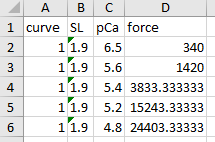
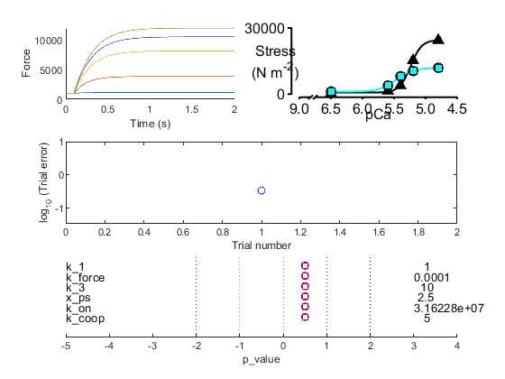
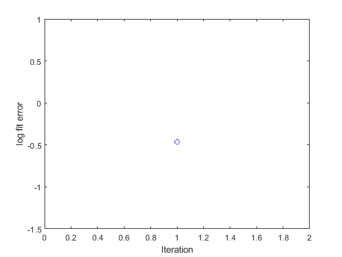
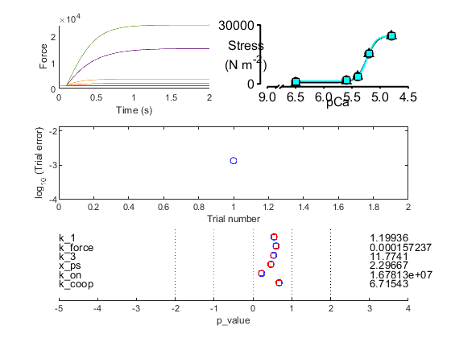
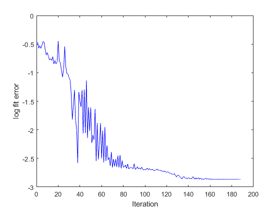

# Fitting a single pCa curve

This demo shows how to fit a simulation to a single force pCa curve. This example will be easier to follow if you have already looked at the [fitting in time domain 1 example](../time_domain_1/fitting_time_domain_1.html).

## Instructions

+ Launch MATLAB
+ Change the MATLAB working directory to `<repo>/code/demos/fitting/single_tension_pCa`
+ Open `demo_fit_simple_tension_pCa.m`
+ Press <kbd>F5</kbd> to run the demo

## Code

Here is the MATLAB code to perform the fit. It is very simple because all of the information defining the process is stored in the optimization file.

````
function demo_fit_simple_tension_pCa
% Function demonstrates fitting a simple tension-pCa curve

% Variables
optimization_file_string = 'sim_input/optimization.json';

% Code

% Make sure the path allows us to find the right files
addpath(genpath('../../../../code'));

% Load optimization job
opt_json = loadjson(optimization_file_string);
opt_structure = opt_json.MyoSim_optimization;

% Start the optimization
fit_controller(opt_structure, ...
    'single_run', 0);
````

## What the code does

The first 3 lines of (non-commented) code
+ make sure the MATMyoSim project is available on the current path
+ sets the file which definines an [optimization structure](..\..\structures\optimization_structure.html)  
+ loads the structure into memory

The last line of code calls `fit_controller.m` which runs the optimization defined in `optimization.json`

## Optimization file

Here's the optimization file.

````
{
	"MyoSim_optimization":
	{
        "model_template_file_string": "sim_input/model_template.json",

        "fit_mode": "fit_pCa_curve",
        "fit_variable": "muscle_force",

        "target_file_string": "target_data/target_force_pCa_data.xlsx",
        "target_field": "force",
        
        "best_model_folder": "temp/best",
        "best_opt_file_string": "temp/best/single_tension_pCa.json",

        "figure_current_fit": 2,
        "figure_optimization_progress": 3, 
        
        "job":
        [
            {
                "model_file_string": "temp/65/model_worker_65.json",
                "protocol_file_string": "sim_input/65/protocol_65.txt",
                "options_file_string": "sim_input/sim_options.json",
                "results_file_string": "temp/65/results_65.myo"
            },
            {
                "model_file_string": "temp/56/model_worker_56.json",
                "protocol_file_string": "sim_input/56/protocol_56.txt",
                "options_file_string": "sim_input/sim_options.json",
                "results_file_string": "temp/56/results_56.myo"
            },
            {
                "model_file_string": "temp/54/model_worker_54.json",
                "protocol_file_string": "sim_input/54/protocol_54.txt",
                "options_file_string": "sim_input/sim_options.json",
                "results_file_string": "temp/54/results_54.myo"
            },
            {
                "model_file_string": "temp/52/model_worker_52.json",
                "protocol_file_string": "sim_input/52/protocol_52.txt",
                "options_file_string": "sim_input/sim_options.json",
                "results_file_string": "temp/52/results_52.myo"
            },
            {
                "model_file_string": "temp/48/model_worker_48.json",
                "protocol_file_string": "sim_input/48/protocol_48.txt",
                "options_file_string": "sim_input/sim_options.json",
                "results_file_string": "temp/48/results_48.myo"
            }
        ],
        "parameter":
        [
            {
                "name": "k_1",
                "min_value": -1,
                "max_value": 1,
                "p_value": 0.5,
                "p_mode": "log"
            },
            {
                "name": "k_force",
                "min_value": -5,
                "max_value": -3,
                "p_value": 0.5,
                "p_mode": "log"
            },
            {
                "name": "k_3",
                "min_value": 0,
                "max_value": 2,
                "p_value": 0.5,
                "p_mode": "log"
            },
            {
                "name": "x_ps",
                "min_value": 0,
                "max_value": 5,
                "p_value": 0.5,
                "p_mode": "lin"
            },
            {
                "name": "k_on",
                "min_value": 7,
                "max_value": 8,
                "p_value": 0.5,
                "p_mode": "log"
            },
            {
                "name": "k_coop",
                "min_value": 0,
                "max_value": 10,
                "p_value": 0.5,
                "p_mode": "lin"
            }
        ]
    }
}
````

In this case, the target data is defined by the `force` column in an excel file. Here are the data.



These correspond to steady-state force values for a given pCa. To calculate these values in MATMyoSim, we run a simulation for each pCa value until force reaches a steady-state. We then pick off these values and compare them to the target data.

We continue this process, adjusting the parameter values as we go until the fit matches the data to some desired level.

Since there are 5 pCa values, we need to run 5 different simulations. These are defined by the 5 `jobs`.

We have also chosen to allow 5 parameters to vary during the fitting procedures. The initial values and the ranges for these parameters are set in the `parameter` section of the json structure.


## First iteration

The first iteration will produce 2 figures. Note that because MATMyoSim runs the simulations for a tension-pCa curve in parallel using a batch structure, the figures for individual simulations don't display. If you want to check individual simulations, you need to run them one at a time.

Fig 3 summarizes how the simulation matches the target data defined in the optimization structure.
+ top panel, compares the current simulation to the target data
+ middle panel, shows the relative errors for the different trials (although there is only 1 in this case)
+ bottom panel, shows the parameter values



Fig 4 shows a single circle. This is the value of the error function which quantifies the difference between the current simulation and the target data. The goal of the fitting procedure is to lower this value in successive iterations.



## Iterations

The code will continue to run simulations adjusting the values of the two parameters, k_2 and k_on, in an attempt to get the simulated force values to match the target data. As the iterations progress, the value of the error function will trend down, indicating that the fit is getting better.

## Final fit

The final summary and progress figures are shown below. Note that your progress figure might look slightly different because the optimization is based on randomly generated numbers.





## Recovering the best fit

Each time the optimization process found a better fit, it
+ updated the optimization template in `best_opt_file_string`. This file is identical to the original optimization structure but with updated p values.
+ wrote the `model files` for each `job` to the `best_model_folder`.

You can recreate the best fitting simulation using these files. For example, you can update the demo code so that optimization file string points to `temp/best/single_tension_pCa.json`. If you also set the `single_run` option to 1 in the last line, the code will only create a single curve. That is, it won't try and optimize a fit that should already be 'optimal'.

If you need to access the data for individual simulations, you can load the *.myo files defined in the job structures. See other demos on how to do this.
