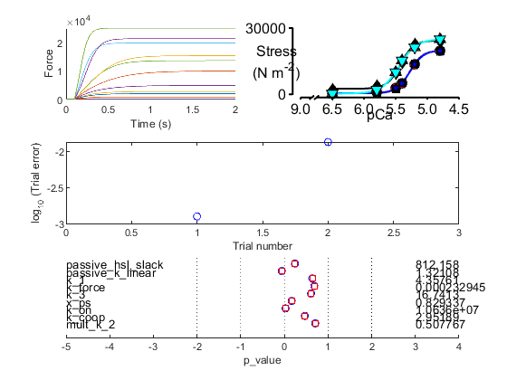
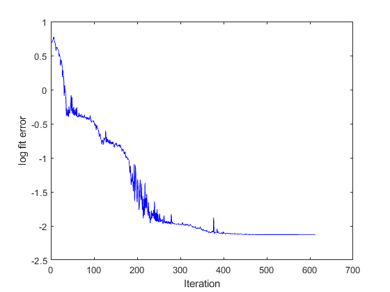

# Fitting pCa curves for two conditions

This demo shows how to fit simulations to two force pCa curves measured in the absence and presence of a drug. It is further assumed that the drug changes just one model parameter, in this case `k_2`. Thus the goal is to find a single set of model parameters that fits the first curve, and by changing only the value of `k_2` fits the second curve as well.

The demo will be easier to follow if you have already looked at the [fitting to a single pCa curve example](../pCa_single_curve/pCa_single_curve.html).

## Instructions

+ Launch MATLAB
+ Change the MATLAB working directory to `<repo>/code/demos/fitting/two_condition_tension_pCa`
+ Open `demo_fit_two_condition_tension_pCa.m`
+ Press <kbd>F5</kbd> to run the demo

## Code

Here is the MATLAB code to perform the fit. As for all the fitting demos, the complexity of of the fitting process is handled by the optimization file.

````
function demo_fit_two_condition_tension_pCa
% Function demonstrates fitting a simple tension-pCa curve

% Variables
optimization_file_string = 'sim_input/optimization.json';

% Code

% Make sure the path allows us to find the right files
addpath(genpath('../../../../code'));

% Load optimization job
opt_json = loadjson(optimization_file_string);
opt_structure = opt_json.MyoSim_optimization;

% Start the optimization
fit_controller(opt_structure, ...
    'single_run', 0);
````

## What the code does

The first 3 lines of (non-commented) code
+ make sure the MATMyoSim project is available on the current path
+ sets the file which definines an [optimization structure](..\..\structures\optimization_structure.html)  
+ loads the structure into memory

The last line of code calls `fit_controller.m` which runs the optimization defined in `optimization.json`

## Optimization file

Here's the optimization file. While it is quite long, the approach is very similar to that used in the [fitting to a single pCa curve example](../pCa_single_curve/pCa_single_curve.html).

This time around, the data in Excel show two curves. The label in the curve column shows which force values go with which curve.


Since each curve is defined by 6 pCa values, the full simulation consists of 12 `jobs`. For simplicity, these are separated into separate folders for combination of curve and pCa value.

````
{
	"MyoSim_optimization":
	{
        "model_template_file_string": "sim_input/model_template.json",

        "fit_mode": "fit_pCa_curve",
        "fit_variable": "muscle_force",

        "target_file_string": "target_data/target_force_pCa_data.xlsx",
        "target_field": "force",
        
        "best_model_folder": "temp/best",
        "best_opt_file_string": "temp/best_tension_pCa_model.json",

        "figure_current_fit": 2,
        "figure_optimization_progress": 3, 
        
        "job":
        [
            {
                "model_file_string": "temp/1/65/model_worker_65.json",
                "protocol_file_string": "sim_input/1/65/protocol_65.txt",
                "options_file_string": "sim_input/sim_options.json",
                "results_file_string": "temp/1/65/65.myo"
            },
            {
                "model_file_string": "temp/1/58/model_worker_58.json",
                "protocol_file_string": "sim_input/1/58/protocol_58.txt",
                "options_file_string": "sim_input/sim_options.json",
                "results_file_string": "temp/1/58/58.myo"
            },
            {
                "model_file_string": "temp/1/55/model_worker_55.json",
                "protocol_file_string": "sim_input/1/55/protocol_55.txt",
                "options_file_string": "sim_input/sim_options.json",
                "results_file_string": "temp/1/55/55.myo"
            },
            {
                "model_file_string": "temp/1/54/model_worker_54.json",
                "protocol_file_string": "sim_input/1/54/protocol_54.txt",
                "options_file_string": "sim_input/sim_options.json",
                "results_file_string": "temp/1/54/54.myo"
            },
            {
                "model_file_string": "temp/1/52/model_worker_52.json",
                "protocol_file_string": "sim_input/1/52/protocol_52.txt",
                "options_file_string": "sim_input/sim_options.json",
                "results_file_string": "temp/1/52/52.myo"
            },
            {
                "model_file_string": "temp/1/48/model_worker_48.json",
                "protocol_file_string": "sim_input/1/48/protocol_48.txt",
                "options_file_string": "sim_input/sim_options.json",
                "results_file_string": "temp/1/48/48.myo"
            },
            {
                "model_file_string": "temp/2/65/model_worker_65.json",
                "protocol_file_string": "sim_input/2/65/protocol_65.txt",
                "options_file_string": "sim_input/sim_options.json",
                "results_file_string": "temp/2/65/65.myo"
            },
            {
                "model_file_string": "temp/2/58/model_worker_58.json",
                "protocol_file_string": "sim_input/2/58/protocol_58.txt",
                "options_file_string": "sim_input/sim_options.json",
                "results_file_string": "temp/2/58/58.myo"
            },
            {
                "model_file_string": "temp/2/55/model_worker_55.json",
                "protocol_file_string": "sim_input/2/55/protocol_55.txt",
                "options_file_string": "sim_input/sim_options.json",
                "results_file_string": "temp/2/55/55.myo"
            },
            {
                "model_file_string": "temp/2/54/model_worker_54.json",
                "protocol_file_string": "sim_input/2/54/protocol_54.txt",
                "options_file_string": "sim_input/sim_options.json",
                "results_file_string": "temp/2/54/54.myo"
            },
            {
                "model_file_string": "temp/2/52/model_worker_52.json",
                "protocol_file_string": "sim_input/2/52/protocol_52.txt",
                "options_file_string": "sim_input/sim_options.json",
                "results_file_string": "temp/2/52/52.myo"
            },
            {
                "model_file_string": "temp/2/48/model_worker_48.json",
                "protocol_file_string": "sim_input/2/48/protocol_48.txt",
                "options_file_string": "sim_input/sim_options.json",
                "results_file_string": "temp/2/48/48.myo"
            }
        ],
        "parameter":
        [
            {
                "name": "passive_hsl_slack",
                "min_value": 800,
                "max_value": 850,
                "p_value": 0.5,
                "p_mode": "lin"
            },
            {
                "name": "passive_k_linear",
                "min_value": 0,
                "max_value": 2,
                "p_value": 0.5,
                "p_mode": "log"
            },
            {
                "name": "k_1",
                "min_value": 0,
                "max_value": 1,
                "p_value": 0.5,
                "p_mode": "log"
            },
            {
                "name": "k_force",
                "min_value": -5,
                "max_value": -3,
                "p_value": 0.5,
                "p_mode": "log"
            },
            {
                "name": "k_3",
                "min_value": 0,
                "max_value": 2,
                "p_value": 0.35,
                "p_mode": "log"
            },
            {
                "name": "x_ps",
                "min_value": 0,
                "max_value": 5,
                "p_value": 0.5,
                "p_mode": "lin"
            },
            {
                "name": "k_on",
                "min_value": 7,
                "max_value": 8,
                "p_value": 0.5,
                "p_mode": "log"
            },
            {
                "name": "k_coop",
                "min_value": 0,
                "max_value": 1,
                "p_value": 0.5,
                "p_mode": "log"
            }
        ],
        "constraint":
        [
            {
                "job_number": 7,
                "parameter_multiplier":
                [
                    {
                        "name": "k_2",
                        "base_job_number": 1,
                        "min_value": -1,
                        "max_value": 0,
                        "p_value": 0.25,
                        "p_mode": "log"
                    }
                ]
            },
            {
                "job_number": 8,
                "parameter_copy":
                [
                    {
                        "name": "k_2",
                        "copy_job_number": 7
                    }
                ]
            },
            {
                "job_number": 9,
                "parameter_copy":
                [
                    {
                        "name": "k_2",
                        "copy_job_number": 7
                    }
                ]
            },
            {
                "job_number": 10,
                "parameter_copy":
                [
                    {
                        "name": "k_2",
                        "copy_job_number": 7
                    }
                ]
            },
            {
                "job_number": 11,
                "parameter_copy":
                [
                    {
                        "name": "k_2",
                        "copy_job_number": 7
                    }
                ]
            },
            {
                "job_number": 12,
                "parameter_copy":
                [
                    {
                        "name": "k_2",
                        "copy_job_number": 7
                    }
                ]
            }
        ]
    }
}
````

As noted in the introduction, most of the simulation parameters should be the same for both curves. Only the `k_2` value should differ. This is handled using a constraint structure. Here's the key section from the above file.

````
        "constraint":
        [
            {
                "job_number": 7,
                "parameter_multiplier":
                [
                    {
                        "name": "k_2",
                        "base_job_number": 1,
                        "min_value": -1,
                        "max_value": 0,
                        "p_value": 0.25,
                        "p_mode": "log"
                    }
                ]
            },
            {
                "job_number": 8,
                "parameter_copy":
                [
                    {
                        "name": "k_2",
                        "copy_job_number": 7
                    }
                ]
            },
        <SNIP>
````

The first constraint is a `parameter_multiplier`. This means that for `job 7`, the value of `k_2` should be the value of `k_2` in `job 1` multiplied by 0.25 (the `p_value`) of the way between 10<sup>-1</sup> and 10<sup>0</sup> on a log-scale. More succinctly, for `job 7`, `k_2` should be between 0.1 and 1 of its value for `job 2`.

The second constraint is a `parameter_copy`. This is simpler. It says that the value of `k_2` for `job 8` should be the same as it was for `job 7`. Look further through the optimization file, and you will see that the value for `k_2` is also copied to jobs 9, 10, 11, and 12.

Putting it all together, the second curve is simulated using the same values for all model parameters other than `k_2` which is between 10% and 100% of its value for `k_1`.

## First iteration

As described for [single pCa curve fit](../pCa_single_curve/pCa_single_curve.html), the first iteration will produce 2 figures.

Fig 3 summarizes how the simulation matches the target data defined in the optimization structure.
+ top panel, compares the current simulation to the target data
+ middle panel, shows the relative errors for the different trials (although there is only 1 in this case)
+ bottom panel, shows the parameter values


Fig 4 shows a single circle. This is the value of the error function which quantifies the difference between the current simulation and the target data. The goal of the fitting procedure is to lower this value in successive iterations.


## Iterations

The code will continue to run simulations adjusting the values of 9 parameters, 8 of which describe the base model, and the last of which is the parameter mulitplier that distinguishes `k_2` for the two curves. As the iterations progress, the value of the error function will trend down, indicating that the fit is getting better.

## Final fit

The final summary and progress figures are shown below. Note that your progress figure might look slightly different because the optimization is based on randomly generated numbers.





## Recovering the best fit

Each time the optimization process found a better fit, it
+ updated the optimization template in `best_opt_file_string`. This file is identical to the original optimization structure but with updated p values.
+ wrote the `model files` for each `job` to the `best_model_folder`.

You can recreate the best fitting simulation using these files. For example, you can update the demo code so that optimization file string points to `temp/best/single_tension_pCa.json`. If you also set the `single_run` option to 1 in the last line, the code will only create a single curve. That is, it won't try and optimize a fit that should already be 'optimal'.

If you need to access the data for individual simulations, you can load the *.myo files defined in the job structures. See other demos on how to do this.
