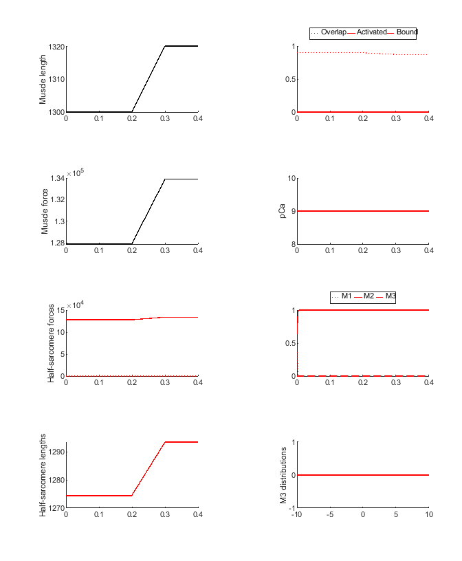
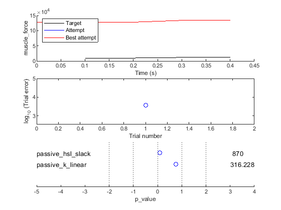
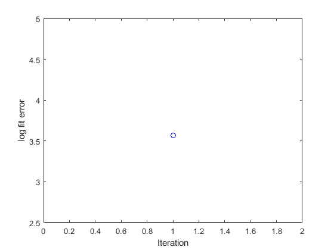
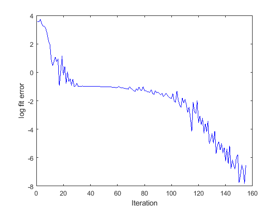

## Fitting in time domain 1

### Code

The MATLAB code for this demo is in `repo\code\demos\fitting\time_domain_1\demo_fit_time_domain_1.m` is very simple.

````
function demo_fit_time_domain_1
% Function demonstates adusting two parameters to fit a ramp stretch

% Add path to the code
addpath(genpath('..\..\..\..\code'));

% Variables
optimization_job_file_string = 'optimization_job.json';

% Code
opt_structure = loadjson(optimization_job_file_string);

% Call controller
fit_controller(opt_structure.MyoSim_optimization);
````

The first 3 lines of code
+ make sure the MATMyoSim project is available on the current path
+ sets the file defining an [optimization structure](..\..\structures\optimization_structure.html)
+ loads the structure into memory

The last line of code calls `fit_controller.m` which runs the optimization defined in `optimization_job.json`


### First iteration

The first iteration will produce 3 figures

Fig 1 shows the simulation. Muscle force is very high (note the y-axis) becaue the passive_hsl_slack is low and passive_k_linear is high.


Fig 2 shows a single value for the objective function. The lower this value, the closer the simulations are to the target data.


Fig 3 summarizes the fit.
+ top panel, compares the current simulation to the target data
+ middle panel, shows the relative errors for the different trials (although there is only 1 in this case)
+ bottom panel, shows the parameter values


### After optimization

Fig 2 shows a single value for the objective function. The lower this value, the closer the simulations are to the target data.


Fig 3 summarizes the fit.
+ top panel, compares the current simulation to the target data
  + in this case, the red line (best fit) lines on top of 3 nearly identical traces
+ middle panel, shows the relative errors for the different trials (although there is only 1 in this case)
+ bottom panel, shows the parameter values



