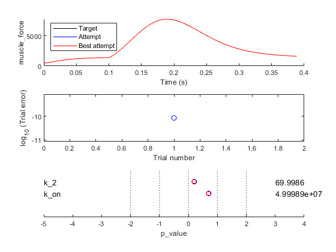

# Fitting in time domain 1

This demo shows how to fit a simulation of a single twitch to a trace showing force against time.

## Instructions

+ Launch MATLAB
+ Change the MATLAB working directory to `<repo>/code/demos/fitting/time_domain_1/demo_fit_time_domain_1.m`
+ Open `demo_fit_time_domain_1.m`
+ Press <kbd>F5</kbd> to run the demo

## Code

As in all the fitting demos, the MATLAB code is very simple.

````
function demo_fit_time_domain_1
% Function demonstates adusting two parameters to fit a ramp stretch

% Add path to the code
addpath(genpath('..\..\..\..\code'));

% Variables
optimization_job_file_string = 'optimization.json';

% Code
opt_structure = loadjson(optimization_job_file_string);

% Call controller
fit_controller(opt_structure.MyoSim_optimization);
````

## What the code does

The first 3 lines of (non-commented) code
+ make sure the MATMyoSim project is available on the current path
+ sets the file containing the [optimization structure](..\..\structures\optimization_structure.html)
+ loads the structure into memory

The last line of code calls `fit_controller.m` which runs the optimization defined in `optimization.json`.

## A closer look at the optimization structure

The demo code above is simple because all of the information required for the fitting process is stored in the `optimization.json` file.

Here it is.

````
{
	"MyoSim_optimization":
	{
        "model_template_file_string": "sim_input/template_model.json",

        "fit_mode": "fit_in_time_domain",
        "fit_variable": "muscle_force",

        "best_model_folder": "temp/best",
        "best_opt_file_string": "temp/best/best_twitch_template.json",

        "figure_current_fit": 3,
        "figure_optimization_progress": 4, 
        
        "job":
        [
            {
                "model_file_string": "temp/model_worker.json",
                "protocol_file_string": "sim_input/protocol.txt",
                "options_file_string": "sim_input/sim_options.json",
                "results_file_string": "temp/twitch.myo",
                "target_file_string": "target/target_force.txt"
            }
        ],
        "parameter":
        [
            {
                "name": "k_2",
                "min_value": 50,
                "max_value": 150,
                "p_value": 0.5,
                "p_mode": "lin"
            },
            {
                "name": "k_on",
                "min_value": 7,
                "max_value": 8,
                "p_value": 0.5,
                "p_mode": "log"
            }
        ]
    }
}
````

As explained in the [documentation](..\..\..\structures\optimization\optimization.html) this file describes a task that:

+ adjusts two parameters in `sim_input/template_model.json'
  + k_2 can range between 50 and 150
  + k_on can range between 10<sup>7</sup> and 10<sup>8</sup>

so that `muscle_force` plotted against time in the

+ simulation calculated in the single `job` defined by
  + `temp/model_worker.json`
  + `sim_input/protocol.txt`
  + `sim_input/sim_options.json`
  
matches the target force data defined in `target/target_force.txt`

The model file for the job will change on each iteration of the optimization. Since the repository doesn't need to track all of these changes, it is best to store the file in a temporary folder that is not tracked by Git.

Similarly, the result file (`twitch.myo`) also changes on each iteration. This file will also be stored in the temporary folder.

Each time the simulation gets closer to the target data, files relating to the simulation will be written to `temp/best`.

The best optimization file obtained to date (that is, a copy of the file displayed above, but with updated p_values) will be saved as `temp/best/best_twitch_template.json`. You can use the values from this file to restart the optimization from a better starting point.

## First iteration

The first iteration will produce 4 figures

Fig 1 shows the simulation.


Fig 2 shows the rates for the simulation.


Fig 3 summarizes how the simulation matches the target data defined in the optimization structure.
+ top panel, compares the current simulation to the target data
+ middle panel, shows the relative errors for the different trials (although there is only 1 in this case)
+ bottom panel, shows the parameter values


Fig 4 shows a single circle. This is the value of the error function which quantifies the difference between the current simulation and the target data. The goal of the fitting procedure is to lower this value in successive iterations.


## Iterations

The code will continue to run simulations adjusting the values of the two parameters, `k_2` and `k_on`, in an attempt to get the simulated force values to match the target data. As the iterations progress, the value of the error function will trend down, indicating that the fit is getting better.

## Final fit

The final summary and progress figures are shown below. Note that your progress figure might look slightly different because the optimization is based on randomly generated numbers.




## Best fitting model

If you run this example and let the optimization finish, you can check the best model file (in `temp\best\model_worker.json` for the parameter values. You should see that `k_2` is close to 70 and `k_on` is close to 5x10<sup>7</sup>.

At this point, if you look in the working folder, you will see that there is another file called `generate_target.m`. If you run that file, it generates the target data from a pre-defined model. Not surprisingly, in that model, `k_2` is 70 and `k_on` is 5x10<sup>7</sup>.

In summary, this demo shows that optimization tasks can find parameter values that allow simulations to match target data. Be aware that, in general, optimizing to _real_ experimental data is harder than fitting to _model generated_ traces.
