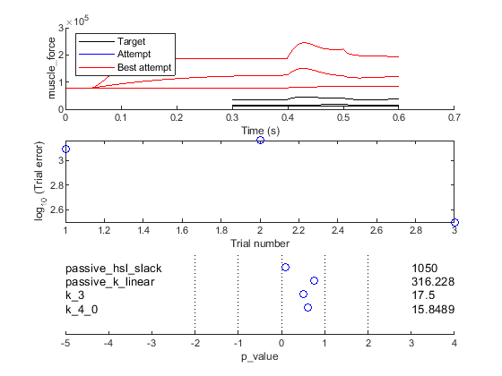
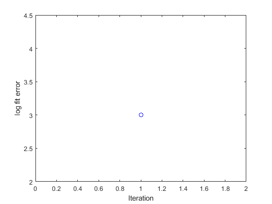
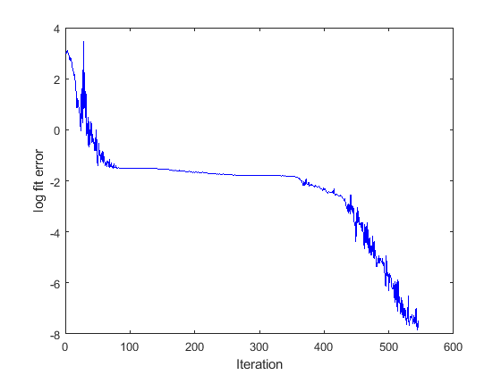

## Fitting in time domain 2

### Code

The MATLAB code for this demo is in `repo\code\demos\fitting\time_domain_2\demo_fit_time_domain_2.m`.

The code is very simple. In fact, the code is the same as for the [fitting_time_domain_1 example](..\time_domain_1\fitting_time_domain_1.html).

````
function demo_fit_time_domain_2
% Function demonstates adusting two parameters to fit a ramp stretch

% Add path to the code
addpath(genpath('..\..\..\..\code'));

% Variables
optimization_job_file_string = 'optimization_job.json';

% Code
opt_structure = loadjson(optimization_job_file_string);

% Call controller
fit_controller(opt_structure.MyoSim_optimization);
````

The first 3 lines of code
+ make sure the MATMyoSim project is available on the current path
+ sets the file defining an [optimization structure](..\..\structures\optimization_structure.html)
+ loads the structure into memory

The last line of code calls `fit_controller.m` which runs the optimization defined in `optimization_job.json`

### Optimization job

````
{
	"MyoSim_optimization":
	{
        "model_template_file_string": "model_parameters.json",
        "model_working_file_string": "..\\..\\temp\\model_worker.json",
        "simulation_options_file_string": "sim_options.json",
        "best_model_file_string": "..\\..\\temp\\best_model.json",
        "fit_mode": "fit_in_time_domain",
        "fit_variable": "muscle_force",

        "figure_current_fit": 2,
        "figure_optimization_progress": 3, 
        
        "job":
        [
            {
                "protocol_file_string": "protocol_1.txt",
                "results_file_string": "..\\..\\temp\\temp_1.myo",
                "target_file_string": "target_force_1.txt"
            },
            {
                "protocol_file_string": "protocol_2.txt",
                "results_file_string": "..\\..\\temp\\temp_2.myo",
                "target_file_string": "target_force_2.txt"
            },
            {
                "protocol_file_string": "protocol_3.txt",
                "results_file_string": "..\\..\\temp\\temp_3.myo",
                "target_file_string": "target_force_3.txt"
            }
        ],

        "parameter":
        [
            {
                "name": "passive_hsl_slack",
                "min_value": 1000,
                "max_value": 1500,
                "p_value": 0.1,
                "p_mode": "lin"
            },
            {
                "name": "passive_k_linear",
                "min_value": 1,
                "max_value": 3,
                "p_value": 0.75,
                "p_mode": "log"
            },
            {
                "name": "k_3",
                "min_value": 5,
                "max_value": 30,
                "p_value": 0.5,
                "p_mode": "lin"
            },
            {
                "name": "k_4_0",
                "min_value": 0,
                "max_value": 2,
                "p_value": 0.6,
                "p_mode": "log"
            }
        ]
    }
}
````


### First iteration

The first iteration will produce 2 figures.

Fig 2 shows a single value for the objective function. The lower this value, the closer the simulations are to the target data.


Fig 3 summarizes the fit.
+ top panel, compares the current simulation to the target data
+ middle panel, shows the relative errors for the 3 different trials
+ bottom panel, shows the parameter values


### After optimization

Fig 2 shows a single value for the objective function. The lower this value, the closer the simulations are to the target data.


Fig 3 summarizes the fit.
+ top panel, compares the current simulation to the target data
  + in this case, the red line (best fit) lines on top of 3 nearly identical traces
+ middle panel, shows the relative errors for the different trials (although there is only 1 in this case)
+ bottom panel, shows the parameter values

