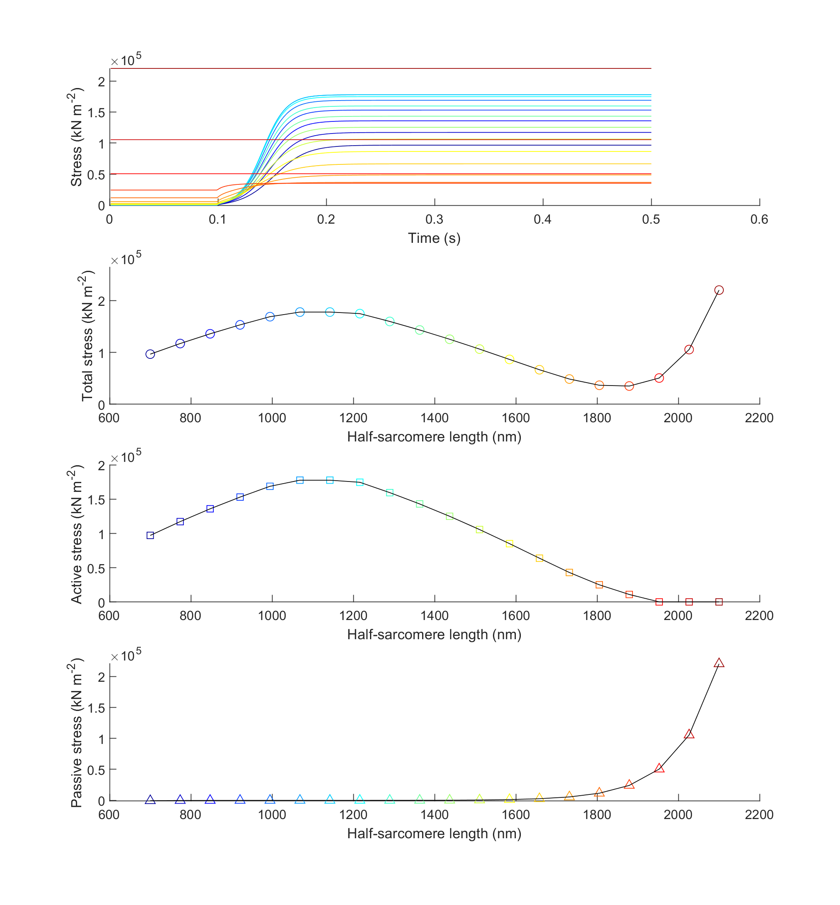

# Force length 1

## Overview

This demo shows how to simulate steady-state length tension curves.

## What this demo does

This demo runs a series of simulations in which a half-sarcomere is activated at different lengths.

## Instructions

+ In MATLAB, change the working directory to `<repo>/code/demos/force_length/force_length_1`
+ Open `force_length_1.m`
+ Press <kbd>F5</kbd> to run

## Output

After the program finishes you should see a figure.



## How this worked

The first section of the code sets up some variables and adds the MATMyoSim folders to the current path. Line 10 creates an array called `hs_lengths` that contains 20 values evenly spaced between 700 and 2000.

````
function demo_force_length_1
% Demo demonstrates force_length curve

% Variables
base_model_file = 'sim_input/base_model.json';
options_file = 'sim_input/options.json';
protocol_file = 'sim_input/protocol.txt';
results_base_file = 'sim_output/results';
no_of_time_points = 500;
time_step = 0.001;
hs_lengths = linspace(700, 2000, 20);

% Make sure the path allows us to find the right files
addpath(genpath('../../../../code'));
````

The next section generates an isometric [protocol](../../../structures/protocol/protocol.html) and saves it to file.

````

% Generate a protocol
generate_isometric_pCa_protocol( ...
    'time_step', time_step, ...
    'no_of_points', no_of_time_points, ...
    'during_pCa', 4.5, ...
    'output_file_string', protocol_file);
````

The next section loads the base model from file, and loops through `hs_lengths`, updating the base model with each new length and writing it to disk. The files for each job are stored in a batch structure.

````
% Load the base_model
base_model = loadjson(base_model_file);

% Create a batch structure

% Now loop through the hs_lengths
for i = 1 : numel(hs_lengths)
    
    % Create and save a new model file for each length
    model = base_model;
    model.MyoSim_model.hs_props.hs_length = hs_lengths(i);
    
    model_file = fullfile(cd, 'sim_input', 'hs_models', ...
        sprintf('model_%i.json', i));
    savejson('MyoSim_model', model.MyoSim_model, model_file);
    
    % Set up the results file
    results_file{i} = sprintf('%s_%i.myo',results_base_file, i);
    
    % Add the job to the batch structure
    batch_structure.job{i}.model_file_string = model_file;
    batch_structure.job{i}.options_file_string = options_file;
    batch_structure.job{i}.protocol_file_string = protocol_file;
    batch_structure.job{i}.results_file_string = results_file{i};
end
````

The next section is very short and simply runs the batch jobs in parallel.

````
% Now that you have all the files, run the batch jobs in parallel
run_batch(batch_structure);
````

The final section loads the results files back into memory and plots
+ force against time for each trial (top plot)
+ steady-state total force against half-sarcomere length (second plot)
+ steady-state active force against half-sarcomere length (third plot)
+ passive force against half-sarcomere length (bottom plot)
