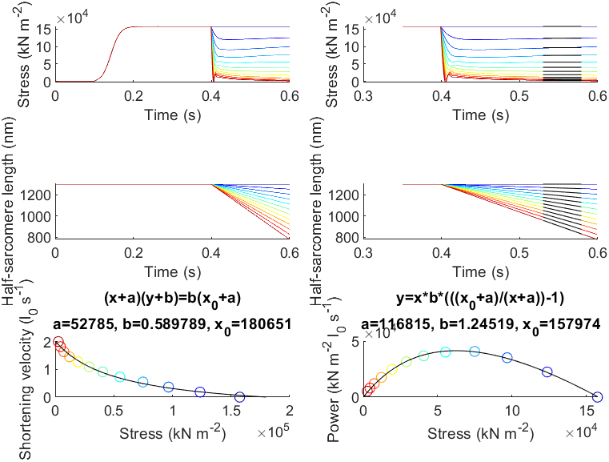

# Force velocity 2

## Overview

This demo shows how to simulate an experiment that measures the force-velocity and force-power curves.

## What this demo does

This demo runs a series of simulations in which a half-sarcomere is activated and then constrained to shorten at different velocities.

Each force record shows a transient response at the beginning of the ramp shortening. The force-velocity curve is determined by calculating the:
+ shortening velocity from the (defined) length record
+ mean force late in the shortening response when the transient has largely decayed and force is approximately constant.

## Instructions

+ In MATLAB, change the working directory to `<repo>/code/demos/force_velocity/force_velocity_2`
+ Open `force_velocity_2.m`
+ Press <kbd>F5</kbd> to run

## Output

After the program finishes (it may take a minute or so) you should see a figure.



## How this worked

The first section of the code sets up some variables and adds the MATMyoSim folders to the current path. Line 9 creates an array called `shortening_velocities` that contains 12 values evenly spaced between 0 and 2 muscle lengths per second.

````
% Variables
model_file = 'sim_input/model.json';
options_file = 'sim_input/options.json';
protocol_base_file = 'sim_input/prot';
results_base_file = 'sim_output/results';
shortening_velocities = linspace(0, 2, 12);
no_of_time_points = 600;
time_step = 0.001;
shortening_start_s = 0.4;
fit_time_s = [0.53 0.58];
display_time_s = [0.35 0.6];


% Make sure the path allows us to find the right files
addpath(genpath('../../../../code'));
````

The next section loops through `shortening_velocities` creating a length controlled protocol file for each condition.

The file names are stored in a batch structure as the loop progresses.

````
% Generate protocols, storing files as a batch structure
batch_structure = [];
for i = 1 : numel(shortening_velocities)
    protocol_file{i} = fullfile(base_dir, ...
                        sprintf('%s_%i.txt', protocol_base_file, i));
    results_file{i} = fullfile(base_dir, ...
                        sprintf('%s_%i.myo', results_base_file, i));

    % Set up the dhsl vector
    dhsl = zeros(no_of_time_points,1);
    dhsl(si) = -shortening_velocities(i) * initial_hsl * time_step;
    
    generate_length_control_pCa_protocol( ...
        'time_step', time_step, ...
        'no_of_points', no_of_time_points, ...
        'during_pCa', 4.5, ...
        'dhsl', dhsl, ...
        'output_file_string', protocol_file{i});
    
    % Add job as an element of an array
    batch_structure.job{i}.model_file_string = model_file;
    batch_structure.job{i}.options_file_string = options_file;
    batch_structure.job{i}.protocol_file_string = protocol_file{i};
    batch_structure.job{i}.results_file_string = results_file{i};
end
````

The rest of the file is as described for [demo_force_velocity_1](../force_velocity_1/force_velocity_1.html)
