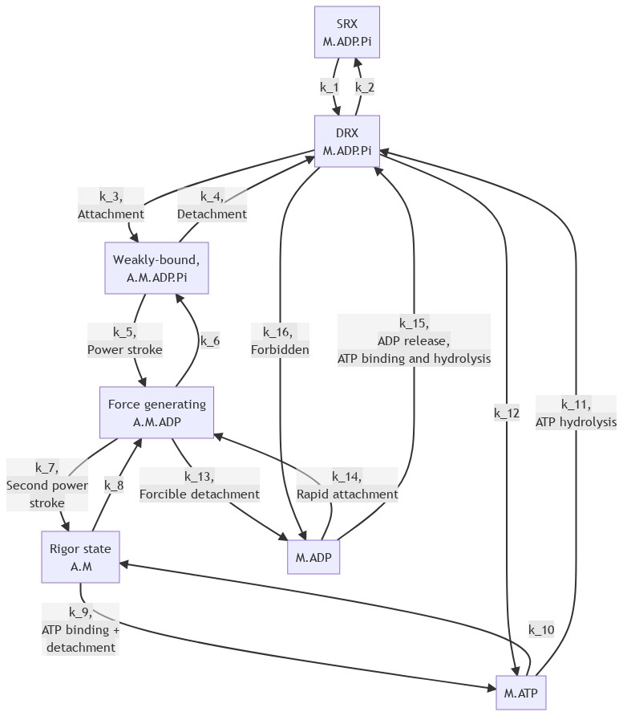
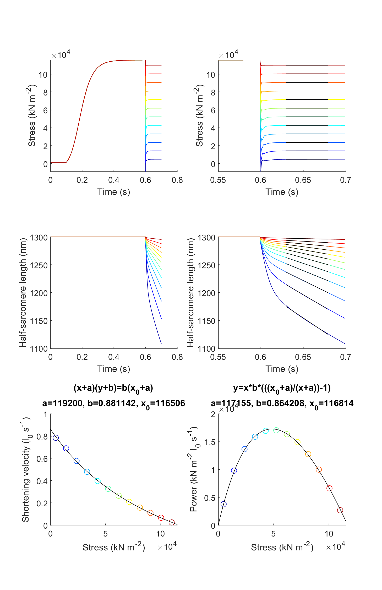

# Force velocity 7

## Overview

This demo builds on the [Force velocity 1 demo](../force_velocity_1/force_velocity.html). The only difference is that the simulation uses a kinetic scheme for myosin that has 7 states rather than 3 states.

## Cross-bridge scheme



## What this demo does

This demo runs a series of simulations in which a half-sarcomere is activated and then allowed to shorten against different loads.

The shortening velocity is calculated during the isotonic release phase of each trial.

## Instructions

+ In MATLAB, change the working directory to `<repo>/code/demos/force_velocity/force_velocity_1`
+ Open `force_velocity_1.m`
+ Press <kbd>F5</kbd> to run

## Output

After the program finishes (it may take a minute or so) you should see a figure.



## How this worked

The first section of the code sets up some variables and adds the MATMyoSim folders to the current path. Line 9 creates an array called `isotonic_forces` that contains 12 values evenly spaced between 5000 and 1.2e5.

````
function demo_force_velocity_7
% Demo demonstrates a force_velocity curve

% Variables
model_file = 'sim_input/model.json';
options_file = 'sim_input/options.json';
protocol_base_file = 'sim_input/prot';
results_base_file = 'sim_output/results';
isotonic_forces = linspace(5000, 1.1e5, 12);
no_of_time_points = 700;
time_step = 0.001;
isotonic_start_s = 0.6;
fit_time_s = [0.63 0.68];
display_time_s = [0.55 0.7];

% Make sure the path allows us to find the right files
addpath(genpath('../../../../code'));
````

The next section loops through `isotonic_forces` creating a protocol file for each condition. Specifically, the `Mode` values for the latter portion of each protocol are set to the appropriate force value. As described in the [protocol page](../../../structures/protocol/protocol.html) this switches MATMyoSim to a force-control mode so that the model length changes as required to keep force at the specific value.

The file names are stored in a batch structure as the loop progresses.

````
% Generate protocols, storing files as a batch structure
batch_structure = [];
for i = 1 : numel(isotonic_forces)
    protocol_file{i} = sprintf('%s_%i.txt', protocol_base_file, i);
    results_file{i} = sprintf('%s_%i.myo', results_base_file, i);

    generate_isotonic_pCa_protocol( ...
        'time_step', time_step, ...
        'no_of_points', no_of_time_points, ...
        'during_pCa', 4.5, ...
        'isotonic_start_s', isotonic_start_s, ...
        'isotonic_stress', isotonic_forces(i), ...
        'output_file_string', ...
            sprintf('%s_%i.txt', protocol_base_file, i));
    
    % Add job as an element of an array
    batch_structure.job{i}.model_file_string = model_file;
    batch_structure.job{i}.options_file_string = options_file;
    batch_structure.job{i}.protocol_file_string = protocol_file{i};
    batch_structure.job{i}.results_file_string = results_file{i};
end
````

The next section is very short. It runs all 12 simulations in parallel using all of the threads that are available to MATLAB.

````

% Now that you have all the files, run the batch jobs in parallel
run_batch(batch_structure);
````

The next section loads the results files back into memory and plots the force and length traces. The force and shortening velocity for each simulation are calculated from (1) mean force and (2) the slope of the half-sarcomere length against time during the isotonic release phase.

````
% Now load the result files and calculate force-velocity and power
% Display the data as you go
figure(4);
clf;
cm = jet(numel(isotonic_forces));

for i = 1 : numel(isotonic_forces)
    
    % Load the simulation back in
    sim = load(results_file{i}, '-mat');
    sim_output = sim.sim_output;

    % Display the full simulation
    subplot(3,2,1);
    hold on;
    plot(sim_output.time_s, sim_output.hs_force, '-', 'Color', cm(i,:));
    subplot(3,2,3);
    hold on;
    plot(sim_output.time_s, sim_output.hs_length, '-', 'Color', cm(i,:));
    
    % Find the indices for fitting
    vi = find((sim_output.time_s > fit_time_s(1)) & ...
            (sim_output.time_s <= fit_time_s(end)));
    
    % Pull off mean force and shortening velocity
    stress(i) = mean(sim_output.hs_force(vi));
    p = polyfit(sim_output.time_s(vi), sim_output.hs_length(vi), 1);
    velocity(i) = -p(1) ./ sim_output.hs_length(1);
    power(i) = stress(i) * velocity(i);
    
    % Display the zoomed area with the fits
    di = find((sim_output.time_s > display_time_s(1)) & ...
            (sim_output.time_s <= display_time_s(end)));
    
    subplot(3,2,2);
    hold on;
    plot(sim_output.time_s(di), sim_output.hs_force(di),  '-', 'Color', cm(i,:));
    plot(sim_output.time_s(vi), stress(i) * ones(numel(vi),1), 'k-');
    subplot(3,2,4);
    hold on;
    plot(sim_output.time_s(di), sim_output.hs_length(di),  '-', 'Color', cm(i,:));
    plot(sim_output.time_s(vi), polyval(p, sim_output.time_s(vi)), 'k-');
    
    % Add in force-velocity and force-power curves
    subplot(3,2,5);
    hold on;
    plot(stress(i), velocity(i), 'o', 'Color', cm(i,:));
    
    subplot(3,2,6);
    hold on;
    plot(stress(i), power(i), 'o', 'Color', cm(i,:));
    
    % Add labels
    if (i == numel(isotonic_forces))
        for j=1:2
            subplot(3,2,j);
            xlabel('Time (s)');
            ylabel('Stress (kN m^{-2})');
            subplot(3,2,j+2);
            xlabel('Time (s)');
            ylabel('Half-sarcomere length (nm)');
        end
        subplot(3,2,5);
        xlabel('Stress (kN m^{-2})');
        ylabel('Shortening velocity (l_0 s^{-1})');
        subplot(3,2,6);
        xlabel('Stress (kN m^{-2})');
        ylabel('Power (kN m^{-2} l_0 s^{-1})');
    end
end
````

The last section fits smooth curves to the force-velocity and force-power data.

````
% Add in fits for fv and force power curves

% First the fv curve
[x0,a,b,r_squared,stress_fit,vel_fit] = fit_hyperbola( ...
    'x_data', stress, 'y_data', velocity, ...
    'x_fit', linspace(0, 2e5, 100));
subplot(3,2,5);
vi = find(vel_fit>=0);
plot(stress_fit(vi), vel_fit(vi), 'k-');
title(sprintf('(x+a)(y+b)=b(x_0+a)\na=%g, b=%g, x_0=%g',a,b,x0));

% Now the power curve
[x0,a,b,r_squared,stress_fit,pow_fit] = fit_power_curve(...
    stress, power, ...
    'x_fit', linspace(0, 2e5, 100));
subplot(3,2,6);
vi = find(pow_fit>=0);
plot(stress_fit(vi), pow_fit(vi), 'k-');
title(sprintf('y=x*b*(((x_0+a)/(x+a))-1)\na=%g, b=%g, x_0=%g',a,b,x0));
````
