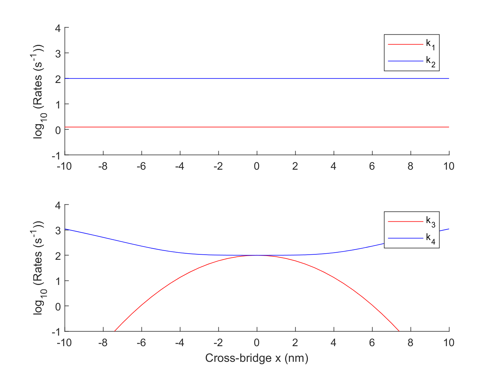
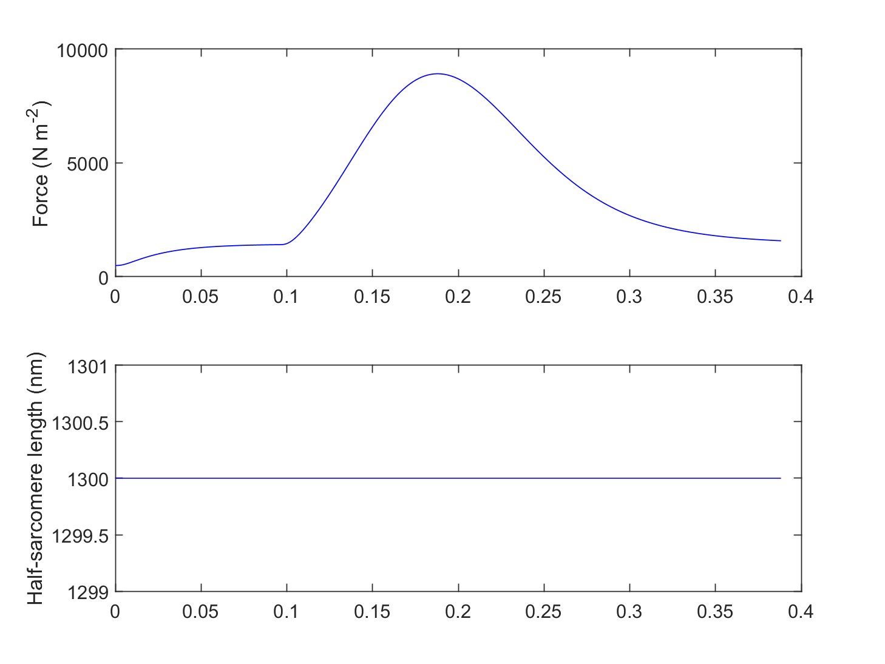

# Demo of simple twitch

This demo shows how to run a simulation of a single twitch

## Instructions

+ Launch MATLAB.
+ Change directory to the `MATMyoSim\code\demos\getting_started\simple_twitch` folder in MATLAB.
+ Open `demo_simple_twitch_1.m`.
+ Press <kbd>F5</kbd> to run the demo.

## Code

````
function demo_twitch_1
% Function illustrates how to run a simulation of a single-half-sarcomere
% held isometric and activated by a transient pulse of Ca2+

% Variables
protocol_file_string = 'protocol.txt';
model_parameters_json_file_string = 'twitch_1_model.json';
options_file_string = 'twitch_1_options.json';
model_output_file_string = '..\..\temp\twitch_1_output.myo';

% Make sure the path allows us to find the right files
addpath(genpath('..\..\..\..\code'));

% Run a simulation
sim_output = simulation_driver( ...
    'simulation_protocol_file_string', protocol_file_string, ...
    'model_json_file_string', model_parameters_json_file_string, ...
    'options_json_file_string', options_file_string, ...
    'output_file_string', model_output_file_string);

% Load it back up and display to show how that can be done
sim = load(model_output_file_string,'-mat')
sim_output = sim.sim_output

figure(3);
clf;
subplot(2,1,1);
plot(sim_output.time_s,sim_output.muscle_force,'b-');
ylabel('Force (N m^{-2})');
subplot(2,1,2);
plot(sim_output.time_s,sim_output.hs_length,'b-');
ylabel('Half-sarcomere length (nm)');
````

## Model

The model is defined in `repo\code\demos\twitches\twitch_1\twitch_1.json`. See [models](../../../structures/model/model.html) for more details.


````
{
    "MyoSim_model":
    {
        "code":
        {
            "version": "2.1.1"
        },
        "muscle_props":
        {
            "no_of_half_sarcomeres": 1,
            "series_k_linear_per_hs": 0
        },
        "hs_props":
        {
            "kinetic_scheme": "3state_with_SRX",
            "hs_length": 1300,
            "myofilaments":
            {
                "bin_min": -10,
                "bin_max": 10,
                "bin_width": 0.5,
                "thick_filament_length": 815,
                "thin_filament_length": 1120,
                "bare_zone_length": 80
            },
            "parameters":
            {
                "k_1": 1,
                "k_force": 5e-4,
                "k_2": 100,
                "k_3": 100,
                "k_4_0": 100,
                "k_4_1": 0.1,
                "k_cb": 0.001,
                "x_ps": 5,
                "k_on": 8e7,
                "k_off": 200,
                "k_coop": 1,
                "int_passive_force_mode": "linear",
                "int_passive_hsl_slack": 1265,
                "int_passive_k_linear": 14,
                "compliance_factor": 0.5,
                "cb_number_density": 6.9e16,
                "k_boltzmann": 1.38e-23,
                "temperature": 288,
                "max_rate": 5000
            }
        }
    }
}
````


## Output

Simulation output


Rates



Replotted from output file



