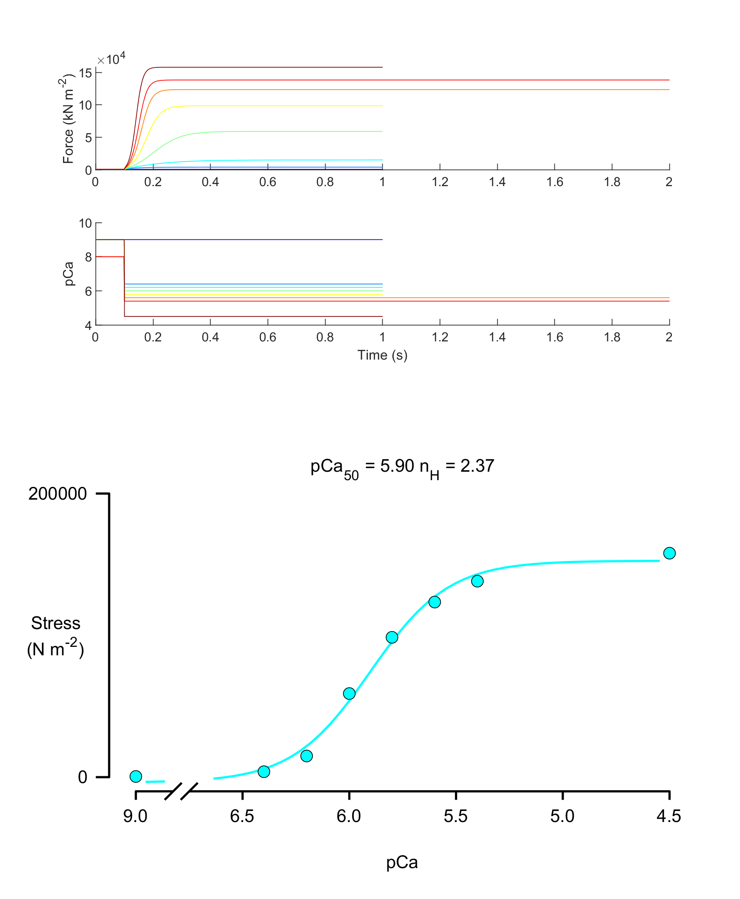

# Demo for tension-pCa

## Overview

This demo shows how to
+ simulate isometric contractions at different levels of Ca<sup>2+</sup> activation
+ fit a 4-parameter Hill-curve to the steady-state tension data

## How this works

The demo initiates a set of simulations using a [batch structure](../../../structures/batch/batch.html).

Each `job` in the batch defines a single simulation. A snippet of the file is shown here.

````
{
    "MyoSim_batch":
    {
        "job":
        [
            {
                "protocol_file_string": "sim_input/90/protocol_90.txt",
                "model_file_string": "sim_input/model_file.json",
                "options_file_string": "sim_input/sim_options.json",
                "results_file_string": "../../temp/sim_output/90/results_90.myo"
            },
            {
                "protocol_file_string": "sim_input/64/protocol_64.txt",
                "model_file_string": "sim_input/model_file.json",
                "options_file_string": "sim_input/sim_options.json",
                "results_file_string": "../../temp/sim_output/64/results_64.myo"
            },
            {
                "protocol_file_string": "sim_input/62/protocol_62.txt",
                "model_file_string": "sim_input/model_file.json",
                "options_file_string": "sim_input/sim_options.json",
                "results_file_string": "../../temp/sim_output/62/results_62.myo"
            },

            <SNIP>
        ]
    }
}
````

Note that every `job` uses the same
+ [model](../../../structures/model/model.html)
+ [simulation options](../../../simulation_options/simulation_options.html)

but a different
+ [protocol](../../../protocol/protocol.html)

The results for each job are also written to different output files

## Code

If you look at the demo code below, you can see that the function `run_batch(batch_data)` runs the entire set of simulations. (Behind the science, it uses a MATLAB parfor loop to run simulations on different threads in parallel.)

Once all of the jobs have finished, it is simple to extract the forces from each file and plot the resulting force-pCa curve.

````
function demo_tension_pCa
% Demo 

% Variables
batch_file_string = 'tension_pCa_batch.json';

% Make sure the path allows us to find the right files
addpath(genpath('../../../../code'));

% Load the batch data
batch_json = loadjson(batch_file_string);
batch_data = batch_json.MyoSim_batch;

% Run the batch
run_batch(batch_data);

% Make a figure showing each file and then plot pCa-force curve

% Make a figure
figure(1);
clf;
color_map = jet(numel(batch_data.job));

for i=1:numel(batch_data.job)
    
    % Load data
    sim = load(batch_data.job{i}.results_file_string, '-mat');
    sim_output = sim.sim_output;    
    
    % Plot force and pCa against time
    subplot(5, 1, 1);
    hold on;
    plot(sim_output.time_s, sim_output.muscle_force, '-', ...
        'Color', color_map(i,:));
    ylabel('Force (kN m^{-2})');
    
    subplot(5, 1, 2);
    hold on;
    pCa_trace = -log10(sim_output.Ca);
    plot(sim_output.time_s, pCa_trace, '-', ...
        'Color', color_map(i,:));
    ylabel('pCa');
    xlabel('Time (s)');
    
    % Keep force and pCa in a structure
    curve_data.pCa(i) = pCa_trace(end);
    curve_data.y(i) = sim_output.muscle_force(end);
    curve_data.y_error(i) = 0;
end

% Fit the tension-pCa curve
[curve_data.pCa50, curve_data.n_H, ...
    curve_data.passive_force, curve_data.active_force, ...
    curve_data.r_squared, curve_data.x_fit, curve_data.y_fit] = ...
        fit_Hill_curve(curve_data.pCa, curve_data.y);

% Plot
title_string = sprintf('pCa_{50} = %.2f n_H = %.2f', ...
                    curve_data.pCa50, curve_data.n_H);

plot_pCa_data_with_y_errors( curve_data, ...
    'axis_handle', subplot(2,1,2), ...
    'y_axis_label',{'Stress','(N m^{-2})'}, ...
    'y_label_offset', -0.1, ...
    'title', title_string);
````

If you want to extend this demo yourself, the folder also contains a function `generate_protocols.m` which creates activation protocols for a sequence of pCa values.

## Instructions

+ Launch MATLAB
+ Change directory to the `<repo>\code\demos\getting_started\tension_pCa` folder in MATLAB
+ Open `demo_tension_pCa.m`
+ Press <kbd>F5</kbd> to run the demo

## Output



