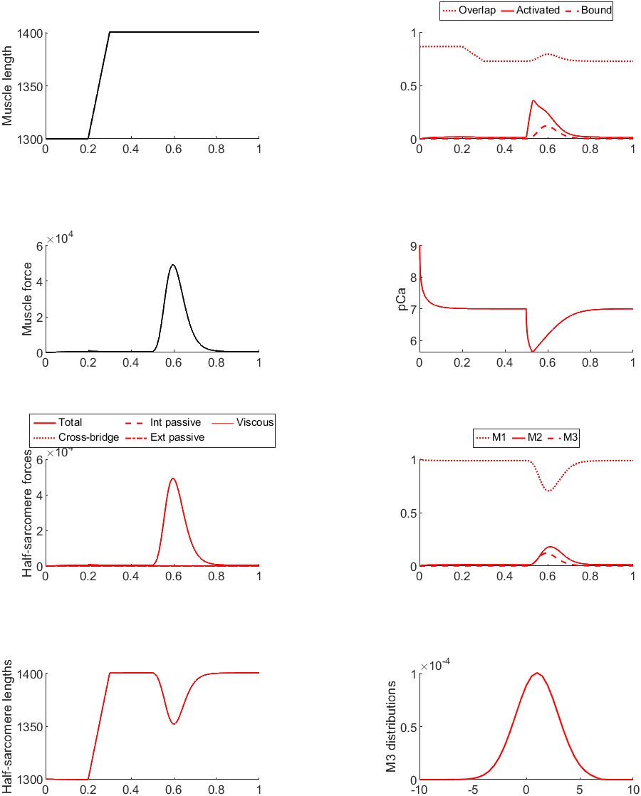

# Myofibrils

## Overview

This demo shows how to simulate a twitch for a myofibril consisting of a snigle half-sarcemere and a series elastic element.

## What this demo does

This demo:
+ runs a single simulation for a single myofibril
+ creates a movie of the simulation

## Instructions

+ In MATLAB, change the working directory to `<repo>/code/demos/myofibrils/myofibril_twitch_1`
+ Open `myofibril_twitch_1.m`
+ Press <kbd>F5</kbd> to run

## Output

After the program finishes (it may take a minute or so) you should see a figure.



## How this worked

The first section of the code sets up some variables, adds the MATMyoSim folders to the current path, and sorts out some folder locations.

````
function demo_myofibril_twitch_1
% Function illustrates how to run a simulation of a single-half-sarcomere
% held isometric and activated by a transient pulse of Ca2+

% Variables
model_file = 'sim_input/model.json';
options_file = 'sim_input/options.json';
protocol_file = 'sim_input/prot.txt';
results_file = 'sim_output/results.myo';
movie_file = 'sim_output/movie.avi';

time_step = 0.001;
no_of_time_points = 1000;
stimulus_times = 0.5;
k_leak = 2e-3;
k_act = 1e-1;
k_serca = 20;

% Target folder for documentation images
doc_image_folder = ...
    '../../../../docs/pages/demos/myofibrils/myofibril_twitch_1'

% base of temp image file for movie_frames
base_temp_image_file_string = 'sim_output/temp';

% Code

% Make sure the path allows us to find the right files
addpath(genpath('..\..\..\..\code'));

% Get the local directory to make sure file paths are right
base_dir = fileparts(mfilename('fullpath'));

% Update sim files
model_file = fullfile(base_dir, model_file);
options_file = fullfile(base_dir, options_file);
protocol_file = fullfile(base_dir, protocol_file);
results_file = fullfile(base_dir, results_file);
````

The next section:
+ generates a protocol with a ramp stretch and a calcium transient
+ runs the simulation
+ saves a figure

````
% Generate dhsl
dhsl = zeros(no_of_time_points, 1);
dhsl(200:300)=1;

% Generate the protocol
generate_protocol_with_stimuli( ...
    'time_step', time_step, ...
    'no_of_points', no_of_time_points, ...
    'stimulus_times', stimulus_times, ...
    'output_file_string', protocol_file, ...
    'k_leak', k_leak, ...
    'k_act', k_act, ...
    'k_serca', k_serca, ...
    'dhsl', dhsl);

% Run a simulation
sim_output = simulation_driver( ...
    'simulation_protocol_file_string', protocol_file, ...
    'model_json_file_string', model_file, ...
    'options_json_file_string', options_file, ...
    'output_file_string', results_file);

% Save the figure for documentation
exportgraphics(gcf, fullfile(doc_image_folder, 'myofibril_twitch_1.png'));
````

The last section creates a movie.

````
% Animate the myofibril
image_file_strings = animate_MyoSim_myofibril( ...
    'model_output_file_string', results_file, ...
    'output_file_string', base_temp_image_file_string, ...
    'skip_frame',100, ...
    'figure_number', 2);

write_image_files_to_movie(image_file_strings, ...
    fullfile(doc_image_folder, 'myofibril_twitch_1.avi'), ...
    'brand_string','');

% Delete the still frames
try
    for i=1:numel(image_file_strings)
        delete(image_file_strings{i})
    end
end
````

