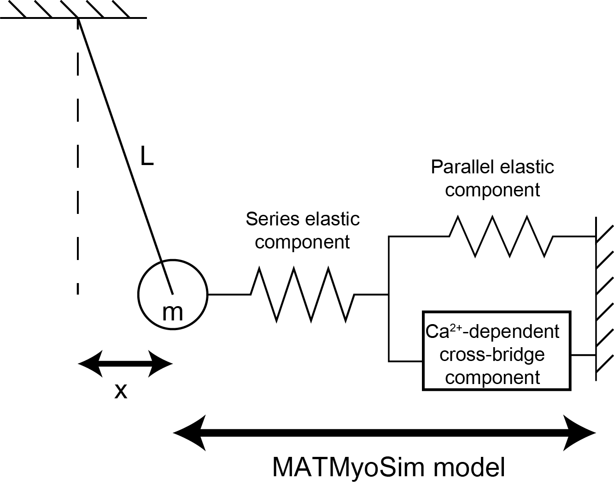

# Pendulum

## Overview

This set of demos connects a MATMyoSim model to a mechanical system  - in this case, a simple pendulum. The intent is to show how the pendulum system and the MATMyoSim model interact. That is, the pendulum perturbs the muscle model, and model influences the pendulum.

## Assumptions

The system is as shown.



The pendulum is mimicked as a mass `m` of length `L`. Small angles are assumed so that when the pendulum is displaced to a position `x`, the horizontal force acting on the pendulum is `m g sin(theta)` which is approximately `m g x / L`.

If the pendulum is subject to viscous damping `eta`, the movement of the pendulum is given by


where `F(x,t)` is the force from the MATMyoSim model. This can be transformed into two coupled first-order equations by defining a new variable `y = dx/dt`.

## Calculations

The simulations are started with the pendulum's position and velocity defined by a vector of initial conditions. The calculations then iterate through a series of time-steps, each of which advances the simulation by `$\Delta$t`.

During each time-step,
+ the movement of the pendulum `$\Delta$x` is calculated by integrating the differential equations for the pendulum.
+ the MATMyoSim model is updated with:
  + the displacement `hsl_scaling_factor * $\Delta$x
  + the Ca<sup>2+</sup> concentration for the time-step

This yields an updated MATMyoSim force the next time-step.

This calculation is performed by the function `implement_pendulum_protocol()` in the simulation class. The behavior of the pendulum is defined by the function `pend_derivs`

````
function dy = pend_derivs(t, yy, pend, f)
    dy = NaN*ones(2,1);
    dy(1)= yy(2);
    dy(2) = (-pend.force_scaling_factor * f / pend.m) - (pend.eta*yy(2) / pend.m) - ...
                (pend.g * yy(1) / pend.L);
end
````

This approach could be modified in future work to simulate different systems.

## Scaling factors

| Parameter | Comment |
| hsl_scaling_factor | the displacement of the MATMyoSim model in nm if the pendulum moves 1 m |
| force_scaling_factor | the force applied to the pendulum in N is the product of `force_scaling_factor` and the stress (force per unit area) predicted by MATMyoSim |

## Pendulum file

The pendulum system is defined by a JSON file. Here is an example.

````
{
    "pendulum":
    {
        "m": 10,
        "L": 0.25,
        "g": 9.81,
        "eta": 0,
        "hsl_scaling_factor": 500,
        "force_scaling_factor": 1e-3,
        "initial_conditions": [0.05, 0]
    }
}
````

The two values in the initial conditions array define the starting position (in m) and velocity (in m s<sup>-1</sup>) respectively.

See the demos for examples.