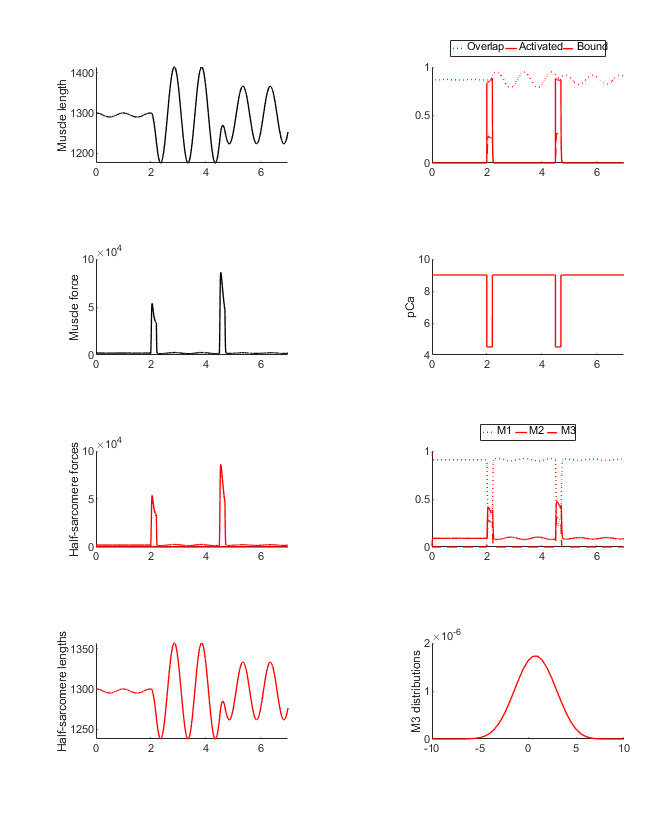
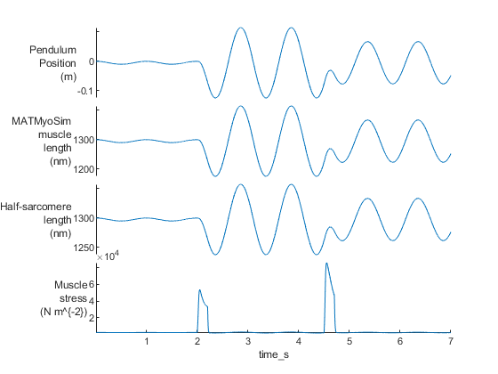

# Pendulum

## Overview

This demo builds on the [pendulum_1 demo](../pendulum_1/pendulum_1.html) and shows a pendulum connected to a muscle that is transiently activated.

## What this demo does

This demo runs a single simulation with a pendulum
+ released from its zero position
+ connected to a MATMyoSim model that
  + has passive stiffness
  + is transiently activated by bursts of Ca<sup>2+</sup>

## Instructions

+ In MATLAB, change the working directory to `<repo>/code/demos/pendulum/pendulum_2`
+ open `demo_pendulum_2.m`
+ Press <kbd>F5</kbd> to run

## Output

You should see two figures



and



## How this worked

This demo is very similar to [pendulum_1 demo](../pendulum_1/pendulum_1.html) except that the pendulum is started with an initial position of 0 and an initial velocity of 0. These are defined in the last entry in `sim_input/pendulum.json`.

````
{
    "pendulum":
    {
        "m": 10,
        "L": 0.25,
        "g": 9.81,
        "eta": 0,
        "hsl_scaling_factor": 500,
        "force_scaling_factor": 1e-3,
        "initial_conditions": [0.0, 0]
    }
}
````

The other key difference is that the MATMyoSim muscle is transiently activated by 2 bursts of Ca<sup>2+</sup>. These are defined in the `demo_pendulum_2.m` file.

````

% Brief activations
pCa(2000:2200) = 4.5;
pCa(4500:4700) = 4.5;
````

The first pulse generates a transient force that increases the magnitude of the pendulum's swing. The second pulse is timed to partially brake the motion.


The first section of the demo code is

````
function demo_pendulum_1

% Variables
model_file = 'sim_input/model.json'
pendulum_file = 'sim_input/pendulum.json'
options_file = 'sim_input/options.json'
output_file = 'sim_output/output.myo'

% Make sure the path allows us to find the right files
addpath(genpath('../../../../code'));

% Create a simulation
sim = simulation(model_file)

% Set up a mini protocol with the number of time-points
% and pCa held at 9
no_of_time_points = 5000;
pCa = 9.0 * ones(no_of_time_points, 1);
dt = 0.001*ones(no_of_time_points,1);
````

This sets some filenames, updates the MATLAB path, and initialises a simulation based on a MATMyoSim [model file](../../../structures/model/model.html).

The last three lines create a mini protocol with:
+ 5000 time-points
+ each with a pCa value of 9.0
+ and a time-step of 0.001 s

The next section

````
% Implement the protocol
sim.implement_pendulum_protocol( ...
    'pendulum_file_string', pendulum_file, ...
    'options_file_string', options_file, ...
    'dt', dt, ...
    'pCa', pCa);

% Save the output
sim_output = sim.sim_output;

if (~isempty(output_file))
    % Check directory exists
    output_dir = fileparts(output_file);
    if (~isdir(output_dir))
        sprintf('Creating output directory: %s', fullfile(cd,output_dir))
        [status, msg, msgID] = mkdir(output_dir);
    end
    save(output_file,'sim_output');
end
````

implements the pendulum protocol and saves the output to a MATLAB file.

The last section

````
% Convert sim_output to a table - this requires deleting some fields
sim_output = sim.sim_output;
sim_output = rmfield(sim_output, 'myosim_muscle');
sim_output = rmfield(sim_output, 'subplots');
sim_output = rmfield(sim_output, 'no_of_time_points');
sim_output = rmfield(sim_output, 'cb_pops')
sim_output = struct2table(sim_output);

% Draw some of the output fields as a stacked plot
figure(3);
clf
stackedplot(sim_output, ...
    {'pendulum_position', 'muscle_length', 'hs_length', ...
    'hs_force'}, ...
    'XVariable', 'time_s', ...
    'DisplayLabels', { ...
        {'Pendulum','Position','(m)'}, ...
        {'MATMyoSim','muscle','length','(nm)'}, ...
        {'Half-sarcomere','length','(nm)'}, ...
        {'Muscle','stress','(N m^{-2})'}});
````

converts the output data to a MATLAB table and plots some of the key variables using the `stackedplot` function.

## Interpretation

The `sim_input/pendulum.json` file defined the initial conditions of the pendulum as a position of 0.05 m and 0 velocity.

````
{
    "pendulum":
    {
        "m": 10,
        "L": 0.25,
        "g": 9.81,
        "eta": 0,
        "hsl_scaling_factor": 500,
        "force_scaling_factor": 1e-3,
        "initial_conditions": [0.05, 0]
    }
}
````

The activating Ca<sup>2+</sup> concentration remained low throughout the simulation (pCa = 9.0 throughout) so the pendulum swung perturbed only by the passive stiffness of the MATMyoSim muscle.
