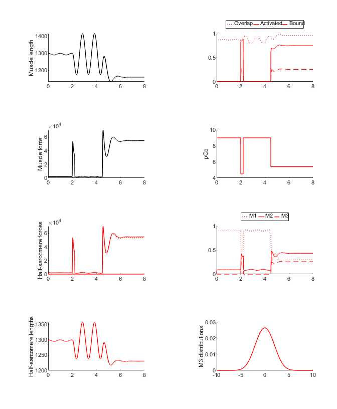
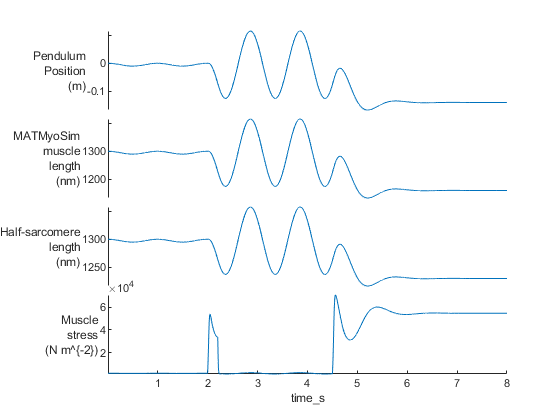

# Pendulum

## Overview

This demo builds on the [pendulum_2 demo](../pendulum_2/pendulum_2.html) and shows a pendulum that is perturbed by a brief activation and then by a sustained contraction.

## What this demo does

This demo runs a single simulation with a pendulum
+ released from its-zero position
+ connected to a MATMyoSim model that
  + is initially activated with a burst of Ca<sup>2+</sup>
  + and then with a sustained sub-maximal level of Ca<sup>2+</sup>

## Instructions

+ In MATLAB, change the working directory to `<repo>/code/demos/pendulum/pendulum_3`
+ open `demo_pendulum_3.m`
+ Press <kbd>F5</kbd> to run

## Output

You should see two figures



and



## How this worked

This demo is very similar to [pendulum_2 demo](../pendulum_2/pendulum_2.html) except that the second activation is sustained at a sub-maximal level (pCa = 5.4)

````
% Brief activations
pCa(2000:2200) = 4.5;
pCa(4500:8000) = 5.4;
````

This sustained contraction pulls the pendulum to one side and damps the oscillation due to the displacement of the cycling cross-bridges.
