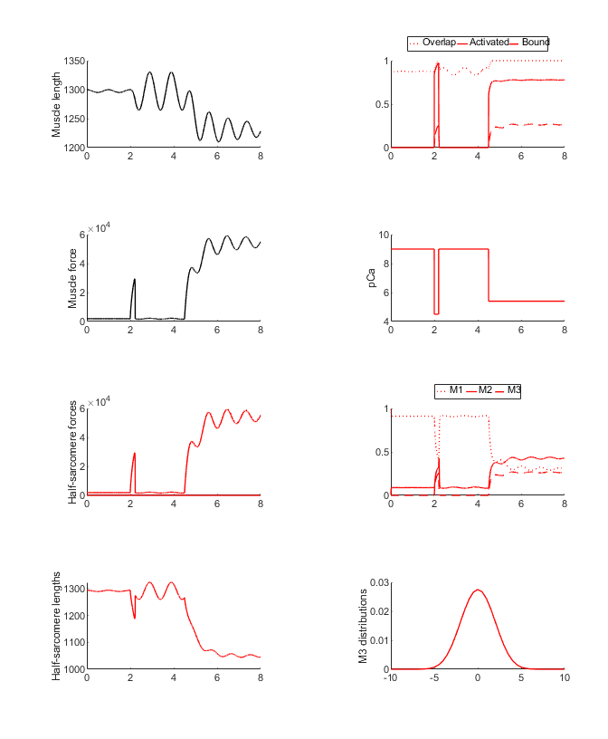
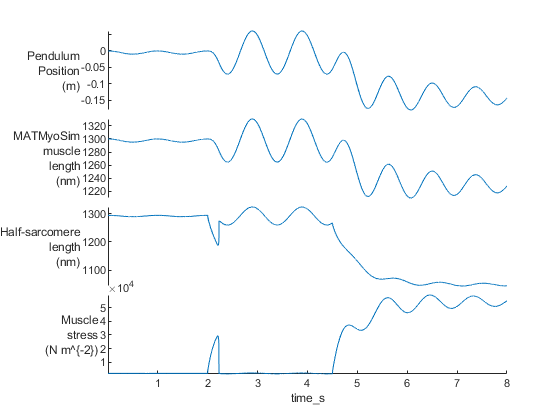

# Pendulum

## Overview

This demo builds on the [pendulum_3 demo](../pendulum_3/pendulum_3.html) but adds series compliance to the MATMyoSim model.

## What this demo does

This demo runs a single simulation with a pendulum
+ released from its-zero position
+ connected to a MATMyoSim model that
  + is initially activated with a burst of Ca<sup>2+</sup>
  + and then with a sustained sub-maximal level of Ca<sup>2+</sup>
  + has a finite series elastic stiffness

## Instructions

+ In MATLAB, open `<repo>/code/demos/pendulum/pendulum_4/demo_pendulum_4.m`
+ Press <kbd>F5</kbd> to run

## Output

You should see two figures



and



## How this worked

This demo is very similar to [pendulum_3 demo](../pendulum_3/pendulum_3.html) except that the series elastic stiffness is defined as 300 N m<sup>-1</sup> in the model file.

````
{
    "MyoSim_model":
    {
        "muscle_props":
        {
            "no_of_half_sarcomeres": 1,
            "series_k_linear_per_hs": 300
        }
        <SNIP>
````

Note that the muscle and half-sarcomere lengths are no-longer idential. The difference bewteen these signals represents the extension of the series compliance.

This sustained contraction pulls the pendulum to one side and damps the oscillation due to the displacement of the cycling cross-bridges.
