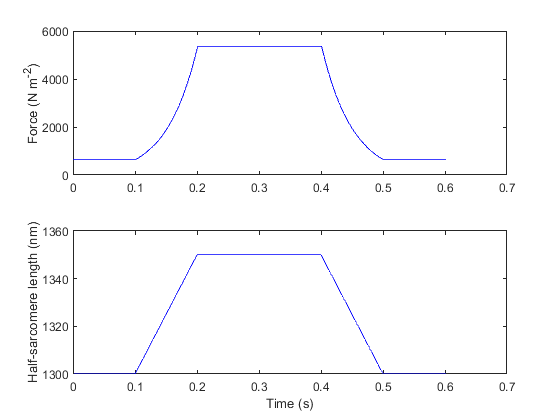

## Ramp demonstration

Force response is due to a passive linear spring and cross-bridges that cycle with a low duty ratio (that is, only a small number are attached at steady-state) but do not generate active force (that is, x_ps = 0)

+ In MATLAB, change directory to `repo\code\demos\ramps\ramp_2`
+ Run ramp_2_demo.m

### Output

