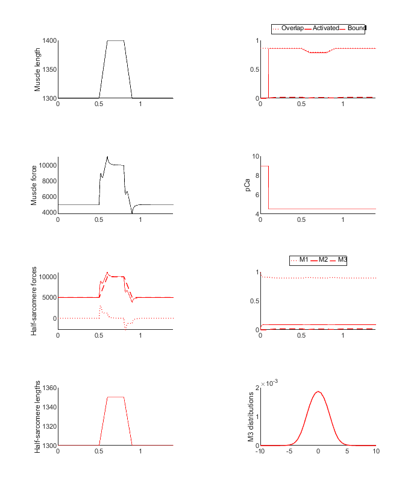
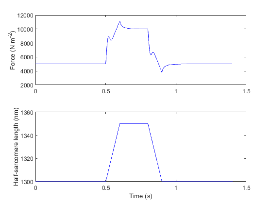

# Ramp 3 demonstration

This demo shows how to run a simulation of a single sarcomere subjected to a ramp, hold, and then release protocol.

It builds on [ramp_1](../ramp_1/ramp_1.html) by adding in a population of cross-bridges that cycle but do not generate force.

## Instructions

+ Launch MATLAB.
+ Change directory to the `MATMyoSim\code\demos\ramps\ramp_3` folder in MATLAB.
+ Open `demo_ramp_3.m`.
+ Press <kbd>F5</kbd> to run the demo.

## Code

````
function demo_ramp_3
% Function illustrates how to run a simulation of a single-half-sarcomere
% with a linear passive elastic component and cycling cross-bridges
% that do not generate active force

% Variables
protocol_file_string = 'ramp_3_protocol.txt';
model_parameters_json_file_string = 'ramp_3_parameters.json';
options_file_string = 'ramp_3_options.json';
model_output_file_string = '..\..\temp\ramp_3_output.myo';

% Make sure the path allows us to find the right files
addpath(genpath('..\..\..\..\code'));

% Run a simulation
sim_output = simulation_driver( ...
    'simulation_protocol_file_string', protocol_file_string, ...
    'model_json_file_string', model_parameters_json_file_string, ...
    'options_json_file_string', options_file_string, ...
    'output_file_string', model_output_file_string);

% Load it back up and display to show how that can be done
sim = load(model_output_file_string,'-mat')
sim_output = sim.sim_output

figure(2);
clf;
subplot(2,1,1);
plot(sim_output.time_s,sim_output.muscle_force,'b-');
ylabel('Force (N m^{-2})');
subplot(2,1,2);
plot(sim_output.time_s,sim_output.hs_length,'b-');
ylabel('Half-sarcomere length (nm)');
xlabel('Time (s)');
````

## Model

The [model](../../../structures/model/model.html) is defined in `repo\code\demos\ramps\ramp_3\ramp_3_parameters.json`.

````
{
    "MyoSim_model":
    {
        "muscle_props":
        {
            "no_of_half_sarcomeres": 1,
            "series_k_linear": 0
        },
        "hs_props":
        {
            "kinetic_scheme": "3state_with_SRX",
            "hs_length": 1300,
            "myofilaments":
            {
                "bin_min": -10,
                "bin_max": 10,
                "bin_width": 0.5,
                "thick_filament_length": 815,
                "thin_filament_length": 1120,
                "bare_zone_length": 80,
                "k_falloff": 0
            },
            "parameters":
            {
                "k_1": 10,
                "k_force": 0.0,
                "k_2": 100,
                "k_3": 1,
                "k_4_0": 20,
                "k_4_1": 0.1,
                "k_cb": 0.001,
                "x_ps": 0,
                "k_on": 6e7,
                "k_off": 200,
                "k_coop": 10,
                "passive_force_mode": "linear",
                "passive_hsl_slack": 1250,
                "passive_k_linear": 100,
                "compliance_factor": 0.5,
                "cb_number_density": 6.9e16,
                "k_boltzmann": 1.38e-23,
                "temperature": 288,
                "max_rate": 5000
            }
        }
    }
}
````

## Output

Simulation output



Replotted from output file


## Comments

If you look at the json model structure, you will see that
+ the passive component is 10 times stiffer than it was in [ramp_1](../ramp_1/ramp_1.html)
  + passive_k_linear is 100 N m<sup>-2</sup> nm<sup>-1</sup> instead of 10 N m<sup>-2</sup> nm<sup>-1</sup>)
+ k_3 = 1 s<sup>-1</sup> nm<sup>-1</sup>
  + As shown in [3state_with_SRX](../../../kinetic_schemes/3state_with_SRX/3state_with_SRX.html) this allows myosin heads to attach to the thin filament
+ x_ps = 0 nm
  + Thus the attached cross-bridges do not generate active force. They do however link the filaments. If the filaments move relative to each other, the attached cross-bridges generate a drag.

The force produced by this model is thus the sum of the linear passive elastic force and a drag from attached cross-bridges. The cycling kinetics of the heads mean that the cross-bridges produce a visco-elastic drag.
