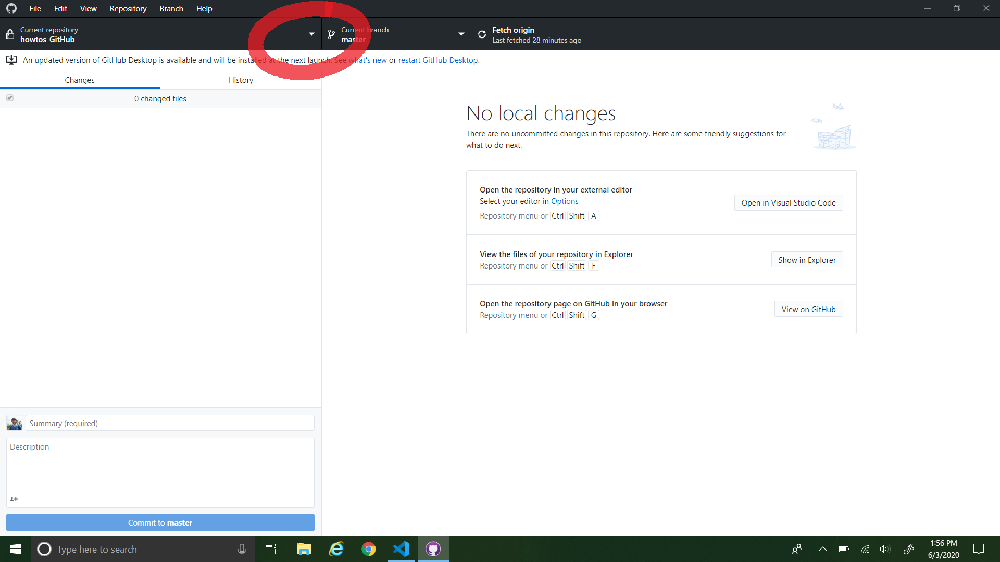
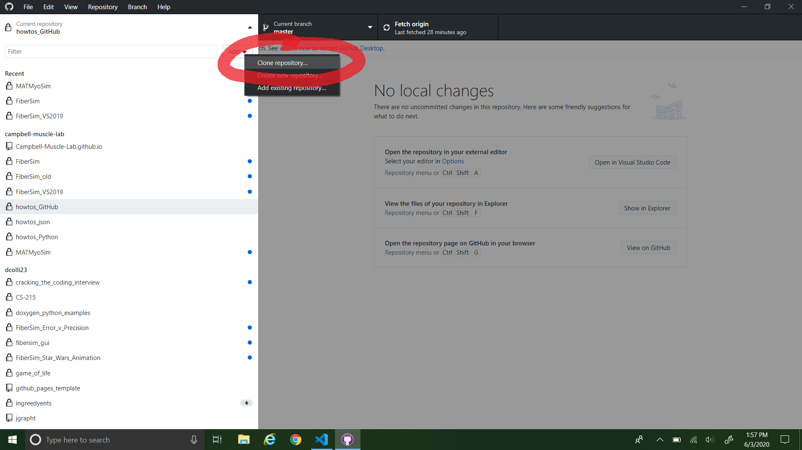

# Cloning MATMyoSim

This page instructs you on how to clone the MATMyoSim repository.

For cloning the MATMyoSim repository, we recommend using the [GitHub Desktop client](https://desktop.github.com/).

To clone the repo:

1. Open GitHub Desktop and click the dropdown menu for repositories.
    
2. Click the "Add" dropdown menu.
    
3. Click the "Clone repository..." button.
    
4. Type "MATMyoSim" into the repository search bar.
    
5. Click the `campbell-muscle-lab/MATMyoSim` repository, describe where you would like the repository to be located on your local machine, then click "Clone".
    
