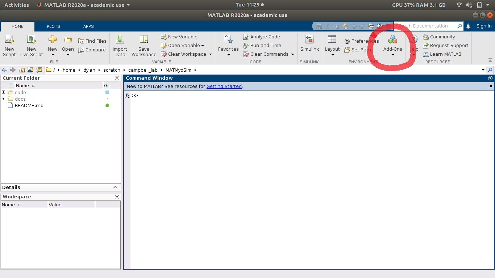
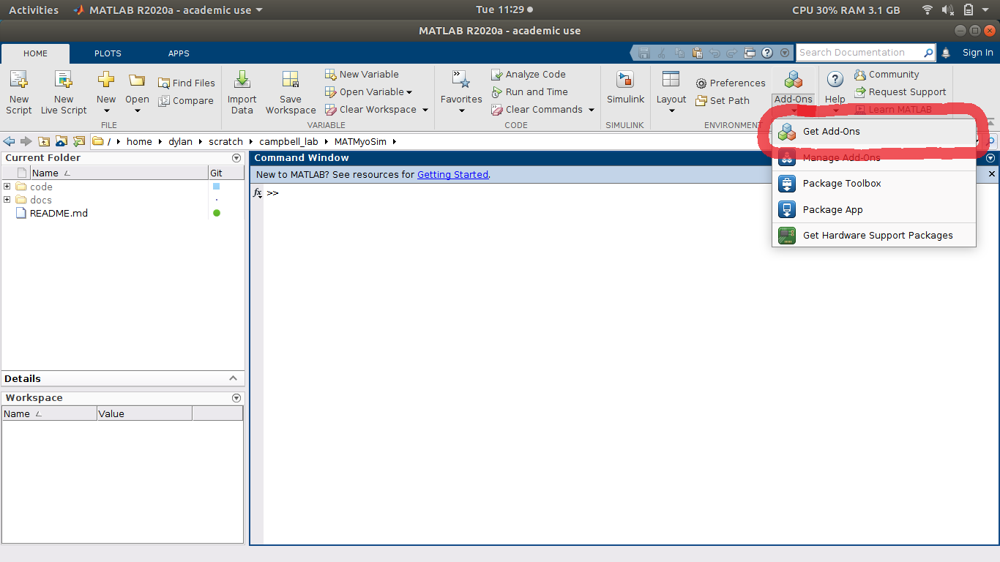
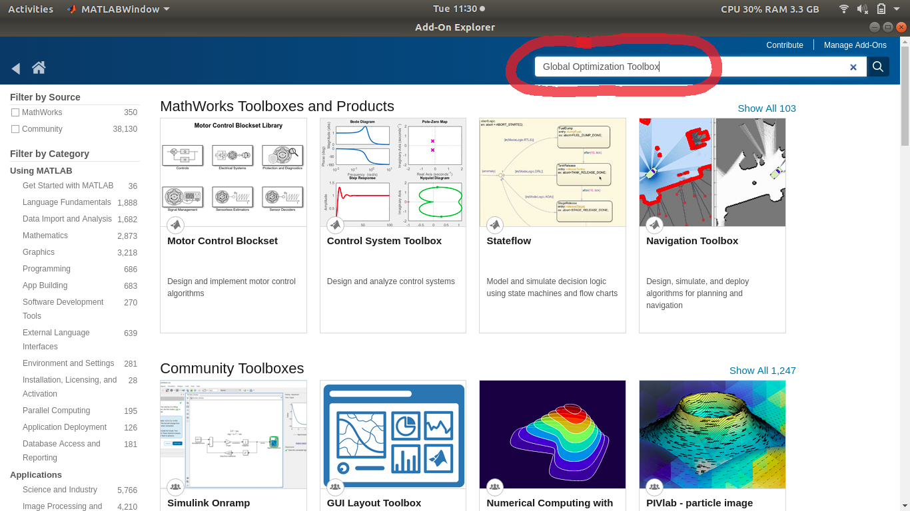
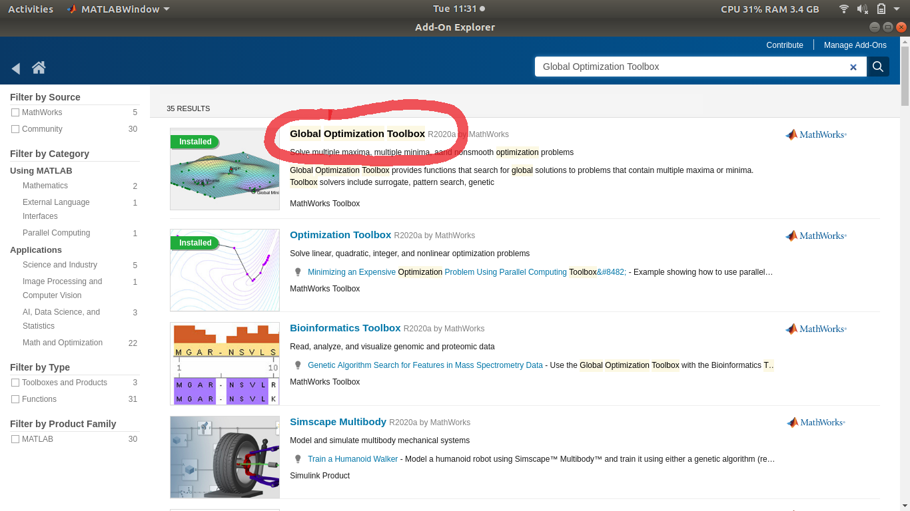
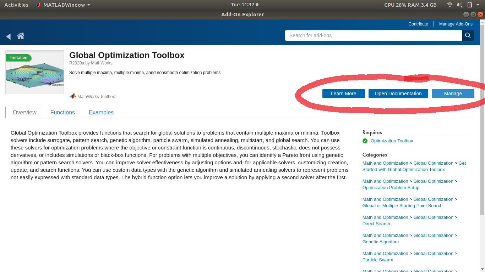

# Installing Dependencies
{:.no_toc}

This page goes over how to install the MATLAB dependencies needed to get MATMyoSim up and running.

* TOC
{:toc}

## List of Dependencies

To work with MATMyoSim, you will need the following MATLAB toolboxes:

+ Global Optimization Toolbox
+ Optimization Toolbox
    + Note that this toolbox is installed when the Global Optimization Toolbox is installed.

## How to Install Dependencies

### Installing the Global Optimization Toolbox

To install the Global Optimization Toolbox from within MATLAB:

1. Open MATLAB and navigate to the HOME tab. Click the Add-Ons icon.
    
2. In the drop-down menu of the Add-Ons icon, select Get Add-Ons.
    
3. In the dialog box pop up, type "Global Optimization Toolbox" into the search bar and hit <kbd>Enter</kbd>.
    
4. Click on the "Global Optimization Toolbox" title.
    
5. Click the install button.
     