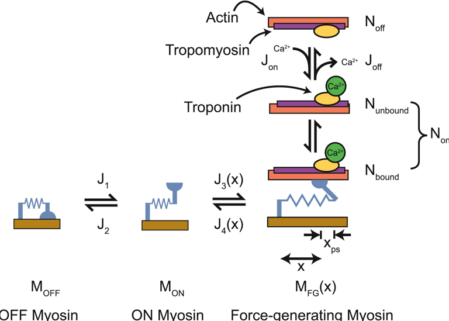

# 3state_with_SRX_and_exp_k4

This scheme is a modification of that described in [PMC6084639](https://www.ncbi.nlm.nih.gov/pmc/articles/PMC6084639/). See the publication for additional details.

See [twitch_1](..//..//demos//twitches//twitch_1//twitch_1.html) for an example simulation using this scheme.

Myosin heads transition between an OFF, an ON, and a force-generating state. Binding sites on actin switch between states that are unavailable and available for myosin heads to attach to.

The fluxes are as defined in [PMC6084639](https://www.ncbi.nlm.nih.gov/pmc/articles/PMC6084639/) except that

J4 = k_4_0 + exp(-k_4_1 * x)

The model parameters that need to be defined in the [model file](..//..//structures//model//model.html) file are:

+ k_1
+ k_force
+ k_2
+ k_3
+ k_4_0
+ k_4_1
+ k_on
+ k_off
+ k_coop
